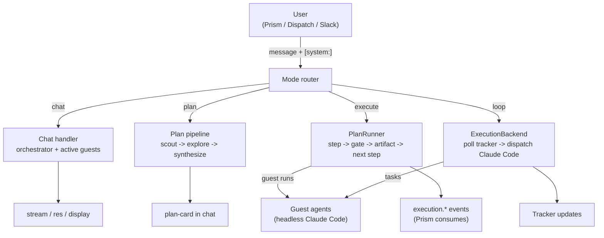

# Anthem

[](https://github.com/rauriemo/anthem/actions/workflows/ci.yml)
[](https://go.dev/dl/)
[](LICENSE)

**Anthem** is a project agent runtime. Each project you work on gets its own Anthem instance -- a persistent orchestrator plus a roster of guest specialist agents -- that you talk to conversationally, plan alongside, and hand off multi-agent pipelines to. Anthem is the daemon that keeps those agents coordinated, the context in sync, and the pipelines moving.

Autonomous issue-driven execution (the original "agentic loop") is now one of four modes, not the headline identity.

[Modes reference](docs/architecture/modes.md) | [Architecture](docs/plans/architecture.md) | [Guest agents](docs/plans/guest-agents.md) | [Prism](https://github.com/rauriemo/prism) (visual workstation) | [Forge](https://github.com/rauriemo/forge) (project scaffolder) | [Dispatch](https://github.com/rauriemo/dispatch) (voice channel)

> **Safety note:** Anthem runs coding agents that can edit files and execute commands. Start in a trusted repo, keep `permission_mode: dontAsk` (the default) until you're comfortable, and use [constraints](#constraints) to define non-negotiables. See the [permission model](#permission-model) below.

## The Four Modes

Every message you send Anthem runs in exactly one mode. Mode is selected explicitly via a `[system:<mode>]` tag; the default is Chat.

| Mode | Purpose | Who runs | Artifacts |
|------|---------|---------|-----------|
| **Chat** | Conversational replies, quick questions, @-mentions of guest specialists, reasoning and small edits | Orchestrator (+ any `active_guests`) | Text + optional display frames |
| **Plan** | Iterative planning with exploration, evidence-backed markdown plans, plan-card handoff | Plan agent (three-phase explorer pipeline, read-only) | Markdown plan in `~/.anthem/plans/` |
| **Execute** | Run an approved multi-agent handoff chain -- a sequence of guest agents producing and consuming artifacts, with human approval gates between steps | `PlanRunner` over guest agents | Structured artifacts in `.context/` + execution events |
| **Loop** | Opt-in autonomous backend. Polls a work source (GitHub issues), claims tasks, dispatches Claude Code workers, retries, and closes on completion | Configured `ExecutionBackend` (e.g. GitHub loop) | Tracker updates + audit log |

Loop is what Anthem used to be by default. It is now one explicit mode that you turn on for issue-driven projects -- most project agents never touch it.

See [docs/architecture/modes.md](docs/architecture/modes.md) for the canonical description of how each mode is wired.

## Quick Start

For a conversational project agent (default):

```bash
# 1. Install
go install github.com/rauriemo/anthem/cmd/anthem@latest

# 2. Initialize (in the repo you want an agent for)
cd /path/to/your-repo
anthem init

# 3. Run
anthem run --log-level info
```

That's it -- Anthem starts in Chat mode, listens on the configured channels (Prism, Dispatch, Slack...), and waits for messages. No GitHub issues, no polling, no tracker configuration required.

To enable Loop mode, keep the default scaffold and add a tracker block to `WORKFLOW.md`:

```yaml
tracker:
  kind: github
  repo: "owner/repo"
  labels:
    active: ["todo", "in-progress"]
    terminal: ["done"]
```

Then start Loop mode by sending a `[system:loop]` message, or use a WORKFLOW-level opt-in (see [modes.md](docs/architecture/modes.md)).

## How It Works


```mermaid
flowchart TD
  User["User\n(Prism / Dispatch / Slack)"] -->|"message + [system:<mode>]"| Router["Mode router"]
  Router -->|chat| Chat["Chat handler\norchestrator + active guests"]
  Router -->|plan| Plan["Plan pipeline\nscout -> explore -> synthesize"]
  Router -->|execute| Exec["PlanRunner\nstep -> gate -> artifact -> next step"]
  Router -->|loop| Loop["ExecutionBackend\npoll tracker -> dispatch Claude Code"]
  Exec -->|guest runs| Guests["Guest agents\n(headless Claude Code)"]
  Loop -->|tasks| Guests
  Chat --> Stream["stream / res / display"]
  Plan --> Card["plan-card in chat"]
  Exec --> Events["execution.* events\n(Prism consumes)"]
  Loop --> Tracker["Tracker updates"]
```

All four modes share the same underlying primitives: guest agent roster, `.context/` for shared state, the channel protocol, and the audit log. What changes is who decides what runs next.

- **Chat / Plan**: the orchestrator (a Claude session) decides.
- **Execute**: code decides, following an approved `ExecutionPlan`. Agents own content; the runner owns control flow.
- **Loop**: an `ExecutionBackend` decides by polling a work source.

## Execute Mode (v1)

Execute runs linear handoff chains of guest agents with optional human approval gates. Shipping today:

- **ExecutionPlan schema** -- ordered `PlanStep` list, optional `DependsOn` for explicit linear order, optional `ApprovalGate` after any step, plan metadata. Validated for duplicate IDs, unknown agents, cycles, and missing dependencies.
- **PlanRunner** -- runs steps mechanically: `pending -> running -> completed/failed`. On failure it pauses the plan. It does not retry on its own; humans or revision gates drive recovery.
- **ArtifactProvider** -- `ContextArtifactProvider` reads `.context/features/<feature>/artifacts.yaml` (and writes upstream manifests for the next step). `FilesystemArtifactProvider` is the fallback for projects without `.context/`, using file modtime snapshots.
- **Approval gates** -- when a gate is configured after a step, the runner emits `execution.gate_opened` with the collected artifacts, blocks, and waits for a `GateResolution` (`approve` / `revise` / `abort`). Prism renders the gate UI; Anthem owns the state.
- **Execution event protocol** -- stable JSON events consumed by Prism:

  | Event | When |
  |-------|------|
  | `execution.plan_loaded` | Plan accepted and validated |
  | `execution.step_queued` | Step eligible to run |
  | `execution.step_started` | Step dispatched to its guest |
  | `execution.step_completed` | Step finished, artifacts collected |
  | `execution.step_failed` | Step error, plan paused |
  | `execution.gate_opened` | Approval gate active, waiting for human |
  | `execution.gate_resolved` | Human resolved the gate |
  | `execution.plan_completed` | Every step completed |
  | `execution.plan_aborted` | Plan aborted at a gate or by error |

Design principles locked in for v1:

- Code owns control flow: step advancement, dependency resolution, gate state, artifact registration, event emission.
- Agents own content: prompts, analysis, file output.
- No autonomous retries. The runner stops on failure and waits for human intervention.
- Linear chains only in v1. Parallel DAG branches and for-each fan-out are deferred to Execute v2.

## Installation

```bash
go install github.com/rauriemo/anthem/cmd/anthem@latest
```

**Requires:** Go 1.26.1+, Claude Code CLI (`claude --version`). Loop mode also requires GitHub auth (`gh auth status` or `GITHUB_TOKEN`).

On Windows, if Smart App Control blocks `go run`, build and run the binary directly (`go build ./cmd/anthem` then `.\anthem.exe`).

**Optional (for video-to-spritesheet post-processing in guest pipelines):**

```bash
winget install Gyan.FFmpeg          # Windows
brew install ffmpeg                 # macOS
pip install "rembg[cli,cpu]"        # CPU inference
pip install "rembg[cli,gpu]"        # NVIDIA/CUDA GPU (faster)
```

Both must be on PATH when Anthem starts. The post-process pipeline degrades gracefully: missing tools cause the corresponding step to be skipped.

## CLI Commands

| Command | Description |
|---------|-------------|
| `anthem init` | Create starter `WORKFLOW.md`, `agents/orchestrator.md`, `.context/`, and bootstrap `~/.anthem/` |
| `anthem run` | Start the runtime (Chat mode by default; Loop starts if enabled in config) |
| `anthem run -w path/to/WORKFLOW.md` | Use a specific workflow file |
| `anthem run --log-level debug` | Verbose logging |
| `anthem validate` | Check `WORKFLOW.md` syntax without starting |
| `anthem version` | Print version |

## Configuration Reference

### Minimal WORKFLOW.md (Chat / Plan / Execute only)

```yaml
---
workspace:
  root: "./workspaces"

agent:
  command: "claude"
  max_turns: 5
  max_concurrent: 3
  stall_timeout_ms: 300000

channels:
  - kind: prism
    target: "localhost:3101"

system:
  constraints:
    - "Never commit secrets or credentials"
---

You are an expert software engineer working on {{.issue.title}}.

## Task
{{.issue.body}}
```

### Adding Loop mode

Add a `tracker:` block and (optionally) `polling:` to run an autonomous backend alongside the conversational modes:

```yaml
tracker:
  kind: github
  repo: "owner/repo"
  labels:
    active: ["todo", "in-progress"]
    terminal: ["done"]

polling:
  interval_ms: 10000

hooks:
  after_create: "git clone {{issue.repo_url}} ."
  before_run: "git pull origin main"
```

Once configured, send `[system:loop]` to start the backend, or wire WORKFLOW-level auto-start (see modes.md).

### Permission Model

```yaml
agent:
  permission_mode: "dontAsk"    # Safe default: only allowed_tools run
  allowed_tools:
    - "Read"
    - "Edit"
    - "Grep"
    - "Glob"
    - "Bash(git *)"
    - "Bash(go test *)"
  denied_tools:
    - "Bash(git push --force *)"
```

In `dontAsk` mode (the default), only tools in `allowed_tools` are auto-approved. Everything else is denied -- the agent sees the denial and adapts. Set `skip_permissions: true` for full autonomy.

### Orchestrator

```yaml
orchestrator:
  enabled: true                 # false = skip the agent layer entirely
  max_context_tokens: 80000     # Session refresh threshold
  max_turns: 10                 # Turn budget for chat/execute consults
  plan_max_turns: 25            # Fallback turn budget for simple plan requests
  explorer_max_turns: 10        # Turn budget per explorer subagent
  max_explorers: 5              # Max parallel explorer subagents
```

Plan mode uses a three-phase explorer architecture: **scout** (read file tree, identify 1-5 areas) → **explore** (parallel read-only Claude Code subagents) → **synthesize** (evidence-backed markdown plan). Write tools are denied across the entire plan pipeline. For trivial requests (scout returns 0 explores), plan mode falls back to a single-run consultation using `plan_max_turns`.

Plan output is markdown-only, saved to `~/.anthem/plans/{project-slug}/` with YAML frontmatter. A **plan-card** is then sent to the channel so Prism can render structured controls (View / Refine / Execute).

### Agent Profiles and Harnesses

Anthem uses a three-layer "Registry + Reference" architecture for agent configuration:

```yaml
agent:
  mcp_servers:
    unity:
      command: "C:/Users/You/.unity/relay/relay_win.exe"
      args: ["--mcp"]
    semgrep:
      command: "semgrep-mcp"
      args: ["--config", "auto"]

  skills:
    - "anthem://owasp-checklist"
    - "./skills/unity-patterns"

  profiles:
    coder:
      prompt_prefix: "You are a coding agent. Write clean, tested code."
    architect:
      prompt_prefix: "You are an architect agent. Analyze and design."
      denied_tools: ["Write", "Edit", "Bash"]
    security-explorer:
      prompt_prefix: "You are a security research agent..."
      mcp_refs: ["semgrep"]
      skill_refs: ["anthem://owasp-checklist"]
      denied_tools: ["Write", "Edit", "MultiEdit"]

  review_enabled: true
  review_max_turns: 3
  review_max_retries: 1
```

**MCP servers** are external tools (Unity Editor, semgrep, databases) registered by name. **Skills** are `SKILL.md` knowledge packages. **Profiles** compose these by reference — `mcp_refs` and `skill_refs` point to registry entries.

**Guest agents** (project `agents/*.md`) can declare their own `mcp_servers` and `allowed_tools`; Anthem merges them with this global registry when dispatching a guest and writes the combined **`{workspace}/.mcp.json`** so Claude Code can attach to Unity and other stdio/HTTP MCP servers.

#### Built-in Skills

Anthem ships 6 core skills compiled into the binary via `go:embed`. These are automatically available to all agents without any external dependencies:

| Skill | Purpose | Default profiles |
|-------|---------|-----------------|
| `anthem://test-verifier` | Go test pyramid: tier selection, coverage collection, structured reports | tester, test-explorer |
| `anthem://gh-issue-verifier` | Evidence-based GitHub issue verification with verdicts | Global (all agents) |
| `anthem://code-review` | Structured 4-category review (security, performance, quality, tests) | Global (all agents), security-explorer |
| `anthem://tdd-classicist` | Language-agnostic TDD methodology, test-double taxonomy | tester, debugger, test-explorer |
| `anthem://go-cli` | Go CLI doctrine: command grammar, exit codes, agent-friendly design | coder |
| `anthem://commit-hygiene` | Conventional commits, separation of concerns, PR quality | coder |

### Channels

Two-way communication with the runtime via pluggable channel adapters. Global credentials live in `~/.anthem/channels.yaml`; per-project channel targets go in `WORKFLOW.md`.

- **Prism** -- primary UI. Visual canvas, chat, mode selector, approval gate UI, artifact viewer. Anthem runs a WebSocket server; Prism connects in.
- **Dispatch** -- voice channel. WebSocket server, voice notifications, chat via voice.
- **Slack** -- two-way Slack integration via Socket Mode.
- **Voice Room** -- always-on LiveKit voice chat with the orchestrator (Deepgram STT + ElevenLabs TTS).

See [docs/plans/architecture.md](docs/plans/architecture.md) for credential formats and wire protocol details.

### Maintenance

Periodic audit log analysis detects health issues (Loop mode only; requires an audit trail of tasks):

```yaml
maintenance:
  scan_interval_ms: 600000       # Every 10 min
  failure_threshold: 3           # Alert after 3+ failures in 24h
  stale_threshold_hours: 24
  cost_anomaly_multiplier: 2.0
  auto_approve: ["repeated_failure"]
```

Signal types: `repeated_failure`, `stale_task`, `budget_anomaly`, `drift`.

### Constraints

Safety guardrails separate from personality, cannot be modified by agents.

**User-level** (`~/.anthem/constraints.yaml`):

```yaml
constraints:
  - "Never force-push to main or master"
  - "Never commit secrets, credentials, API keys, or tokens"
```

**Project-level** (`system.constraints` in `WORKFLOW.md`):

```yaml
system:
  constraints:
    - "Run tests before opening a PR"
```

Both levels combine into a `## Constraints (non-negotiable)` block in the prompt. Anthem appends a meta-constraint preventing agents from editing constraint definitions.

### Agent Identity (Two-File Model)

Anthem uses a two-file identity model:

- **`agents/orchestrator.md`** -- Project-specific orchestrator character. Lives alongside guest agent files in the project's `agents/` directory. Each project's orchestrator develops a unique personality over time. Created by `anthem init` or Forge scaffolding.
- **`~/.anthem/VOICE.md`** -- Global user knowledge shared across all projects. Facts and stable preferences about the user (communication style, working habits, expertise).

Character sections (Identity, Personality, Your Focus, Coordination) route to `agents/orchestrator.md`; user-knowledge sections route to `~/.anthem/VOICE.md`. All routing decisions are logged. Changes to VOICE.md are also logged to `~/.anthem/voice-changelog.md`.

> **Note**: `orchestrator.md` is not a guest agent. It lives in `agents/` for authoring consistency but is explicitly excluded from the `GuestIndex` and never appears in Prism's guest roster.

#### Agent Respec

The `/respec` command starts a conversational flow for creating or updating an agent's `.md` file. The orchestrator walks through 5 phases (Core Identity, Personality, Focus & Scope, Coordination, Flavor), writing changes to the file after each answer.

- `/respec` -- respec the project's orchestrator agent
- `/respec <name>` -- respec a guest agent (creates the file if new)
- `/respec cancel` -- stop the flow (all changes written so far are kept)

### State and Project Files

| File | Purpose |
|------|---------|
| `agents/orchestrator.md` | Project-specific orchestrator character |
| `agents/<slug>.md` | Guest agent personas |
| `.context/artifacts.yaml` | Feature-level artifact registry (used by Execute) |
| `.context/features/<feature>/` | Per-feature plans, artifacts, task-state, changelog |
| `WORKFLOW.md` | Project config (YAML frontmatter + prompt template) |
| `~/.anthem/VOICE.md` | Shared user knowledge |
| `~/.anthem/constraints.yaml` | User-level safety rules |
| `~/.anthem/channels.yaml` | Channel credentials |
| `~/.anthem/state.json` | Persisted retry queue and cost data (Loop mode) |
| `~/.anthem/audit.db` | SQLite audit log |
| `~/.anthem/plans/` | Stored plan artifacts |

## Troubleshooting

| Symptom | Fix |
|---------|-----|
| `anthem: command not found` | Add `$GOPATH/bin` (or `$GOBIN`) to your PATH |
| `claude` not found | Install Claude Code CLI, verify with `claude --version` |
| Nothing happens when I message Anthem | Verify the channel credentials in `~/.anthem/channels.yaml` and the `channels:` block in `WORKFLOW.md` |
| Loop mode isn't picking up tasks | Ensure `tracker:` is configured and the issue has a label from `tracker.labels.active` |
| Tasks stuck as `in-progress` after crash | Rerun Anthem -- it reconciles on startup. Include `in-progress` in `labels.active` |
| Execute plan fails mid-chain | Check `execution.step_failed` event in Prism for the error; plan is paused -- fix and resume, or abort |
| Approval gate never opens in Prism | Verify the Prism channel is connected and the gate's step completed -- check the audit log for `execution.gate_opened` |
| Agent can't run a command | Add the command pattern to `allowed_tools` in `WORKFLOW.md` |
| GitHub auth fails | Check `gh auth status` or verify `GITHUB_TOKEN` has `repo` scope |

## Architecture

Anthem's runtime has four main planes:

- **Mode router** -- `internal/orchestrator/orchestrator.go` parses `[system:<mode>]` tags, routes to the matching handler, and tracks `CurrentMode` as observable state.
- **Chat / Plan handlers** -- conversational pipeline backed by the orchestrator agent, guest dispatch, ConvoBuffer, and SharedContext.
- **Execute subsystem** -- `internal/execute/` (PlanRunner, ArtifactProvider, event emitters) + `internal/plans/` (plan storage + schema).
- **Execution backends** -- `internal/backend/` defines the `ExecutionBackend` interface; `GitHubLoopBackend` is the Loop mode implementation. Additional backends (Linear, webhook-driven, scheduled) can be added behind the same interface.

Cross-cutting services:

- **Channel system** -- pluggable adapters (Prism, Dispatch, Slack, Voice) behind a common `Channel` interface. Execute events flow through the same pipe as chat and status updates.
- **Audit log** -- append-only SQLite at `~/.anthem/audit.db`. Every dispatch, action, gate resolution, voice update, and execution event is recorded.
- **Guest registry** -- `internal/guests/` scans `agents/`, parses frontmatter, caches the index, and exposes personas on demand. Both Chat (`@mentions` + `active_guests`) and Execute (`PlanStep.AgentID`) use the same registry.

See [architecture.md](docs/plans/architecture.md) for the full system design, interfaces, and data flow diagrams.

## Development

```bash
go build ./cmd/anthem        # Build
go test ./... -count=1       # Test
go vet ./...                 # Vet
golangci-lint run ./...      # Lint (matches CI)
```

## Contributing

Contributions welcome. If you're fixing a bug or adding a feature, please open an issue first so we can align on behavior -- especially around safety defaults, permissions, mode semantics, and the Execute event protocol.

See [architecture.md](docs/plans/architecture.md) and [modes.md](docs/architecture/modes.md) for the canonical design.

## License

[MIT](LICENSE)
