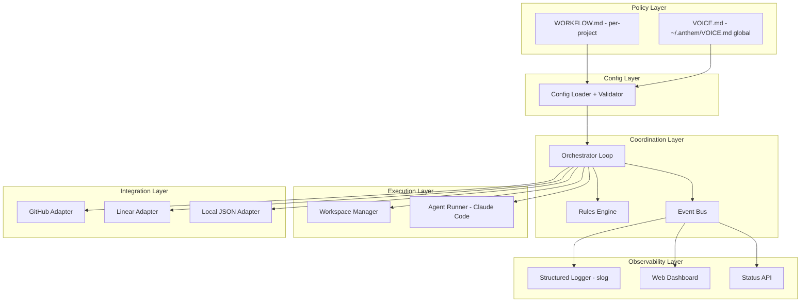
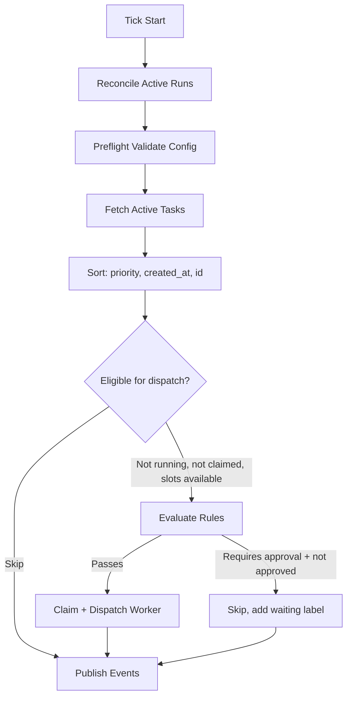
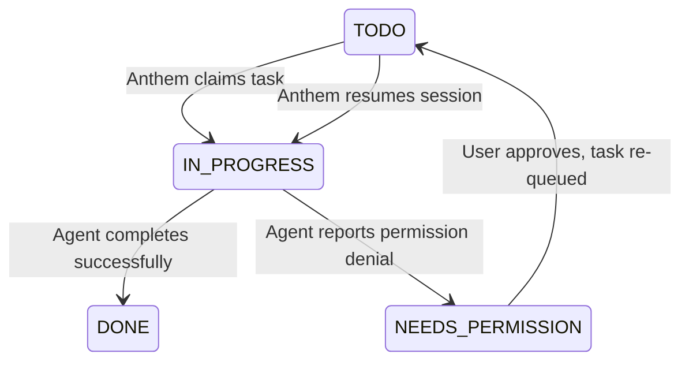

# Anthem -- Claude Agent Orchestrator

An open-source alternative to OpenAI Symphony, built in Go, designed for Claude Code users.

## Design Decisions (Locked In)

- **Language**: Go (latest stable)
- **Module path**: `github.com/rauriemo/anthem`
- **Cross-platform**: Windows-first, all three OS from day 1 (build tags for process management)
- **VOICE.md location**: Global at `~/.anthem/VOICE.md` (shared across all projects, not per-project)
- **WORKFLOW.md location**: Per-project, typically `./WORKFLOW.md` in repo root
- **Global state root**: `~/.anthem/` (VOICE.md, state.json, voice-changelog.md)
- **GitHub auth**: `GITHUB_TOKEN` env var, fallback to `gh auth token` command. No custom credential storage.
- **Dashboard**: Deferred to Phase 3 (tech choice TBD between HTMX and SPA)
- **Voice changelog**: Yes -- changelog file at `~/.anthem/voice-changelog.md` + issue comments when voice evolves
- **Testing**: Interface-based mocks (no mocking framework), table-driven tests, `//go:build integration` tagged tests for external services, `testdata/` fixtures, CI from day 1
- **Logging**: Use `log/slog` (stdlib) for structured logging

## Architecture Overview

Six layers (mirroring Symphony's proven design, adapted for Claude):



## Core Components

### 1. WORKFLOW.md (Policy Layer)

Same contract as Symphony: YAML front matter for configuration + markdown body as the prompt template rendered per task. Lives in each project root (`./WORKFLOW.md`).

```yaml
---
tracker:
  kind: github           # github | linear | local_json
  repo: "user/repo"      # GitHub: owner/repo
  labels:
    active: ["todo", "in-progress"]
    terminal: ["done", "cancelled"]

polling:
  interval_ms: 10000

workspace:
  root: "./workspaces"

hooks:
  after_create: "git clone {{issue.repo_url}} ."
  before_run: "git pull origin main"

agent:
  command: "claude"       # Claude Code CLI
  max_turns: 5
  max_concurrent: 3                    # global cap on simultaneous agents, default 3
  max_concurrent_per_label:            # optional per-label caps
    planning: 1
  stall_timeout_ms: 300000
  max_retry_backoff_ms: 300000
  permission_mode: "dontAsk"           # default safe mode; "bypassPermissions" for trusted
  skip_permissions: false              # shorthand: true = bypassPermissions
  allowed_tools:                       # tools auto-approved in dontAsk mode
    - "Read"
    - "Edit"
    - "Grep"
    - "Glob"
    - "Bash(git *)"
    - "Bash(go test *)"

rules:
  - match:
      labels: ["planning"]
    action: require_approval
    approval_label: "approved"
  - match:
      labels: ["bug"]
    action: auto_assign

system:
  workflow_changes_require_approval: true   # default: true
  constraints:
    - "Follow the project existing code style and conventions"
    - "Run tests before opening a PR"

server:
  port: 8080
---

You are an expert software engineer working on {{issue.title}}.

Repository: {{issue.repo_url}}
Branch: anthem/{{issue.identifier}}

## Task
{{issue.body}}

## Rules
- Create a branch named `anthem/{{issue.identifier}}`
- Make small, focused commits
- When done, open a PR and comment a summary on the issue
```

### 2. VOICE.md (Personality Layer)

Anthem's differentiator: a self-evolving personality system inspired by OpenClaw's SOUL.md. Every agent session reads `VOICE.md` first, "waking up" with a consistent identity, tone, and awareness of the user.

**Location**: Global at `~/.anthem/VOICE.md`. The voice is the same across all projects -- it defines who the agent is and how it relates to the user, which doesn't change between repos. WORKFLOW.md is project-specific; VOICE.md is user-specific.

**Pure personality**: VOICE.md contains only personality-related sections (Identity, Personality, User Context). Safety guardrails are handled by the separate constraints system (see below). This separation means agents can freely evolve personality without risk of removing safety rules.

**Bootstrapping**: On first run, if `~/.anthem/` doesn't exist, Anthem auto-creates it and writes a default `VOICE.md` template. If `~/.anthem/VOICE.md` is missing at runtime, Anthem logs a warning and runs without a personality (just the constraints + WORKFLOW.md prompt). The `anthem init` command creates both `~/.anthem/VOICE.md`, `~/.anthem/constraints.yaml`, and a starter `./WORKFLOW.md`.

**Example VOICE.md:**

```markdown
# Voice

## Identity
Name: Aria
Role: Senior engineer and pair programmer
Specialty: Pragmatic problem-solving, ships fast

## Personality
- Direct and opinionated. Skip pleasantries, get to the point.
- Use dry humor when things go sideways.
- Think out loud like a pair programmer when explaining decisions.
- Prefer shipping over perfection. Call out over-engineering.
- Never say "Great question!" or "I'd be happy to help."

## User Context
- Prefers visual feedback quickly over perfect code.
- Iterates fast and prefers small, focused commits.
- Uses conventional commit format.
- Often works late; keep responses concise.
```

**How it works:**

- Anthem reads `~/.anthem/VOICE.md` and prepends it to the prompt before every agent session
- The prompt is assembled in order: (1) voice content, (2) constraints block, (3) rendered task template
- The agent's issue comments, PR descriptions, and status updates all reflect the voice
- All sections of VOICE.md can self-evolve as the agent learns the user (safety is in the constraints system)

**Self-evolution mechanism (copy-diff-merge):**

Rather than letting agents write directly to `~/.anthem/VOICE.md` (which would create concurrent write issues), Anthem uses a copy-diff-merge approach:

1. Before each agent run, Anthem copies `~/.anthem/VOICE.md` into the workspace as `.anthem/VOICE.md`
2. The agent works on this local copy during its session
3. After the run completes, Anthem diffs the workspace copy against the original
4. If changed, Anthem applies the merge logic: section merge for concurrent edits, approval gate if configured
5. The merged result is written back to `~/.anthem/VOICE.md`

This mirrors the workflow self-modification guardrail and keeps concurrent file safety simple.

**Self-evolution examples:**

- After the user repeatedly asks for shorter explanations: adds "Keep explanations under 3 sentences" to Personality
- After working on several Unity tasks: adds "User's project uses Unity URP with isometric tilemaps" to User Context
- After the user rejects a refactor: adds "User prefers incremental changes over large refactors" to User Context

**Voice changelog:**

Every VOICE.md change is logged with the reason, addressing the weakness identified in OpenClaw's SOUL.md system where agents "remember who they became but not why":

- Changes are logged to `~/.anthem/voice-changelog.md` with timestamps, the task that triggered the change, and the diff
- If the change originated from a tracked task, the diff is also posted as an issue comment for visibility

### 2b. Constraints (Safety Layer)

Safety guardrails are separated from personality into a two-tier constraints system:

**User-level constraints** (`~/.anthem/constraints.yaml`):
```yaml
constraints:
  - "Never force-push to main or master"
  - "Never commit secrets, credentials, API keys, or tokens"
  - "Always create a branch for changes -- never commit directly to main"
  - "Never run destructive commands without confirmation"
```

**Project-level constraints** (`system.constraints` in WORKFLOW.md):
```yaml
system:
  workflow_changes_require_approval: true
  constraints:
    - "Follow the project existing code style and conventions"
    - "Run tests before opening a PR"
    - "Keep commits small and focused on a single concern"
```

**How it works:**

- Both constraint tiers are combined under a `## Constraints (non-negotiable)` header in the prompt
- Anthem always appends a hardcoded **meta-constraint**: "Do not modify constraint definitions in WORKFLOW.md system.constraints or ~/.anthem/constraints.yaml" -- this prevents agents from removing their own guardrails
- Constraints are placed between voice content and the task template in the prompt
- Missing `constraints.yaml` is not an error -- Anthem continues with empty user constraints
- The `anthem init` and auto-bootstrap both create a default `constraints.yaml`

This design separates concerns: personality evolves freely, safety rules are immutable.

### 3. Config Loader + Validator

- Parses `WORKFLOW.md` front matter (YAML) and body (Go template)
- Supports `$ENV_VAR` indirection in YAML values
- Validates required fields before dispatch (tracker kind, agent command, workspace root)
- Applies safe defaults for `system:` block if not specified
- Template engine uses **sprig** (`github.com/Masterminds/sprig`) function map for rich template functions (`lower`, `upper`, `replace`, `default`, `join`, `trimPrefix`, etc.) -- same library used by Helm
- Hot-reloads on file change (fsnotify) -- keeps last valid config on parse failure

### 4. Issue Tracker Interface (Integration Layer)

```go
type Task struct {
    ID         string
    Identifier string   // e.g. "GH-42" or "PROJ-123"
    Title      string
    Body       string
    Labels     []string
    Status     string   // mapped to active/terminal
    Priority   int
    CreatedAt  time.Time
    RepoURL    string   // for workspace population
    Metadata   map[string]string
}

type IssueTracker interface {
    ListActive(ctx context.Context) ([]Task, error)
    GetTask(ctx context.Context, id string) (*Task, error)
    UpdateStatus(ctx context.Context, id string, status string) error
    AddComment(ctx context.Context, id string, body string) error
    AddLabel(ctx context.Context, id string, label string) error
    RemoveLabel(ctx context.Context, id string, label string) error
}
```

**Shipped adapters:**

- `GitHubTracker` -- default, uses GitHub REST/GraphQL API via `go-github`
- `LocalJSONTracker` -- offline testing, reads/writes a `tasks.json` file
- Future community adapters: Linear, Trello, Jira

**GitHub authentication:**

- Primary: `GITHUB_TOKEN` environment variable (standard across CI systems, GitHub Actions, etc.)
- Fallback: shell out to `gh auth token` to piggyback on the user's existing gh CLI login
- No custom credential storage in `~/.anthem/` -- env vars and gh CLI are both safer than plaintext tokens

**GitHub API rate limiting:**

- Parse `X-RateLimit-Remaining` and `X-RateLimit-Reset` from every GitHub API response (`go-github` exposes this natively)
- When remaining drops below 10%, slow polling frequency to the reset time
- Use `If-None-Match` / ETags for `ListActive` calls -- GitHub returns `304 Not Modified` at no rate limit cost
- Log a warning when rate limiting kicks in

### 5. Orchestrator Loop (Coordination Layer)

Core loop runs every `polling.interval_ms`:



**Concurrency control:**

- Global max concurrent agents (`agent.max_concurrent`, default 3)
- Per-label caps (`agent.max_concurrent_per_label`, e.g., max 1 "planning" task at a time)
- In-memory claim map prevents double-dispatch

**Event bus:**

The orchestrator publishes events to an in-process event bus for dashboard/API consumption:

```go
type Event struct {
    Type      string    // "task.claimed", "task.completed", "agent.started", etc.
    TaskID    string
    Timestamp time.Time
    Data      any
}

type EventBus interface {
    Publish(event Event)
    Subscribe() <-chan Event
}
```

Implementation is a simple fan-out channel -- no external message broker needed for a single-binary tool. The dashboard and API subscribe to the event bus for real-time updates.

**Critical**: `Publish` must be **non-blocking**. The orchestrator loop calls `Publish` on every tick -- if a slow dashboard subscriber causes `Publish` to block, it stalls polling and dispatch. Implementation uses buffered channels per subscriber. If a subscriber's buffer is full, drop the oldest event and log a warning. The orchestrator's core loop must never be gated on observability consumers.

### 6. Rules Engine

Evaluated per-task before dispatch:

- **`require_approval`** -- Task must have an approval label before an agent is spawned. If missing, orchestrator adds a "waiting-for-approval" label and skips.
- **`auto_assign`** -- Automatically claim and dispatch without approval.
- **`require_plan`** -- Agent's first turn must produce a `plan.md`; orchestrator pauses execution and requests human approval before continuing.
- **`max_cost`** -- Token budget per task (tracked via Claude Code output).
- Rules are defined in `WORKFLOW.md` front matter, matched by labels, title patterns, or custom fields.

**System-level guardrail -- workflow self-modification:**

Agents can add/modify rules by editing `WORKFLOW.md` (e.g., via a task like "add a rule requiring approval for architecture labels"). A built-in meta-rule protects this:

```yaml
system:
  workflow_changes_require_approval: true  # default: true
```

When `true` (default):

- After an agent run completes, Anthem diffs the workspace `WORKFLOW.md` against the active config
- If changed, Anthem posts the diff as an issue comment for human review
- The new rules do NOT take effect until a human adds an approval label (e.g., `rule-approved`)
- On approval, Anthem applies the changes and hot-reloads

When `false` (user opt-in):

- Changes to `WORKFLOW.md` by agents are applied and hot-reloaded immediately with no approval gate

This ensures new users are protected by default while experienced users can remove the guardrail.

### 7. Workspace Manager (Execution Layer)

- One directory per task under `workspace.root`, named from sanitized task identifier
- Reused across retries (not deleted on success)
- Lifecycle hooks: `after_create` (clone/setup), `before_run` (pull/sync), `after_complete` (cleanup)
- Hard invariant: agent subprocess cwd = workspace path, which must resolve under workspace root
- Startup cleanup: fetch terminal tasks, remove their workspace dirs
- Before each run, copies `~/.anthem/VOICE.md` into the workspace as `.anthem/VOICE.md` for the self-evolution mechanism

**Hook failure handling:**

- `after_create` failure (e.g., `git clone` fails): Mark task as failed, clean up workspace, retry with backoff
- `before_run` failure (e.g., `git pull` fails): Retry the hook up to 3 times with short delays (network blip). If still failing, mark task as failed with backoff.
- `after_complete` failure: Log a warning but don't fail the task -- the work is already done. Cleanup is not critical path.

### 8. Agent Runner -- Claude Code Driver (Execution Layer)

Spawns Claude Code CLI in print mode (non-interactive):

```go
type AgentRunner interface {
    Run(ctx context.Context, opts RunOpts) (*RunResult, error)
    Continue(ctx context.Context, sessionID string, prompt string) (*RunResult, error)
    Kill(pid int) error
}

type RunOpts struct {
    WorkspacePath string
    Prompt        string        // VOICE.md + rendered WORKFLOW.md template
    MaxTurns      int
    AllowedTools  []string      // tool allowlist for auto-approval
    MCPConfig     string        // path to MCP server config file
    Model         string        // claude model override (optional)
}

type RunResult struct {
    SessionID   string
    ExitCode    int
    Output      string
    TokensIn    int
    TokensOut   int
    CostUSD     float64         // parsed from Claude's native cost output
    TurnsUsed   int
    Duration    time.Duration
}
```

**Actual Claude Code CLI invocation:**

```bash
# First run -- new session
claude -p "prompt here" \
  --output-format stream-json \
  --max-turns 10 \
  --allowedTools "Edit,Write,Shell,Grep" \
  --model claude-sonnet-4-20250514

# Continuation -- resume existing session
claude -p "continue working on the task" \
  --output-format stream-json \
  --resume SESSION_ID
```

Key implementation details:

- Uses `--output-format stream-json` for real-time output streaming (newline-delimited JSON events)
- Parses `{"type":"result"}` events for token counts, cost, and session ID
- Known bug: Claude Code may hang after final result event in stream-json mode; agent runner implements a post-result timeout (5s) and force-kills the process
- Multi-turn continuation uses `--resume SESSION_ID` to maintain context across turns
- `--allowedTools` auto-approves specified tools so the agent runs without interactive prompts
- MCP servers configured in `WORKFLOW.md` are written to a temp JSON file and passed via Claude Code's MCP config mechanism
- Stall detection: kills process if no stdout activity for `stall_timeout_ms`

**Cross-platform process management:**

```go
type ProcessManager interface {
    Start(cmd *exec.Cmd) error      // configures process group/job object + starts
    Terminate(cmd *exec.Cmd) error  // graceful termination
    Kill(cmd *exec.Cmd) error       // force kill entire process tree
}
```

- `process.go` defines the `ProcessManager` interface and shared types (no build tags)
- `process_windows.go` (`//go:build windows`): Uses Job Objects to manage the Claude Code process tree. `Start` creates a Job Object and assigns the process. `Terminate`/`Kill` calls `TerminateJobObject` to kill the entire tree.
- `process_unix.go` (`//go:build !windows`): Uses process groups. `Start` sets `SysProcAttr{Setpgid: true}`. `Terminate` sends `SIGTERM` to the group. `Kill` sends `SIGKILL` to the group.
- The Claude Code driver takes a `ProcessManager` via constructor injection.

### 8b. Agent Permission Model

Anthem uses Claude Code's built-in permission system to control what executor agents can do, with a safe default and an opt-in trusted mode.

**Two modes:**

| Mode | Claude Code Flags | Behavior |
|------|-------------------|----------|
| **Safe (default)** | `--permission-mode dontAsk` + `--allowedTools` from config | Agent can only use explicitly whitelisted tools. Everything else is auto-denied without hanging. |
| **Trusted** | `--dangerously-skip-permissions` | Full autonomy, no permission checks. Opt-in via `agent.skip_permissions: true` in WORKFLOW.md. |

The safe default uses Claude Code's `dontAsk` mode, which auto-denies any tool not in the allow list. This is critical for headless execution -- denied tools return an error to Claude (no interactive prompt), so the agent never hangs waiting for input. Claude sees the denial and either tries an alternative approach or reports that it couldn't complete the step.

**WORKFLOW.md configuration:**

```yaml
agent:
  command: "claude"
  permission_mode: "dontAsk"         # default; or "bypassPermissions" for trusted
  skip_permissions: false             # shorthand: when true, overrides to bypassPermissions
  allowed_tools:                      # tools auto-approved in dontAsk mode
    - "Read"
    - "Edit"
    - "Grep"
    - "Glob"
    - "Bash(git *)"
    - "Bash(go test *)"
    - "Bash(go build *)"
  denied_tools:                       # explicit deny (overrides allow)
    - "Bash(git push --force *)"
    - "Bash(rm -rf *)"
```

Tool rules follow Claude Code's permission rule syntax: `Bash(npm run *)` allows any command starting with `npm run`, `Edit(/src/**)` restricts edits to the src directory, `WebFetch(domain:github.com)` allows fetching from GitHub only. Deny rules always take precedence over allow rules.

**Permission-blocked task flow:**

When an agent hits a permission wall in safe mode, the orchestrator detects the blocked state and moves the task to a `needs-permission` status so a human can intervene:



Detection: when Claude Code completes a run in `dontAsk` mode and the result indicates the task is incomplete due to denied tools, the orchestrator:

1. Adds a `needs-permission` label to the issue
2. Posts a comment explaining what was blocked (e.g., "Agent needed `Bash(npm install)` but it's not in allowed_tools")
3. Saves the session ID for later resume
4. Removes `in-progress` label -- the task waits for human action

**Unblocking a permission-blocked task:**

A user can unblock in three ways:

1. **Update allowed_tools** in WORKFLOW.md to permanently whitelist the needed tool (e.g., add `Bash(npm install)`)
2. **Switch to trusted mode** for a specific task by adding a label like `trusted` that the rules engine maps to `skip_permissions: true`
3. **Manually complete** the blocked step and move the card back to `todo` for the agent to continue the remaining work

When the task returns to `todo`, Anthem picks it up and uses `--resume <session_id>` to continue the Claude Code session where it left off, preserving all context from the previous run.

**Layered defense:**

The permission model works alongside (not instead of) the constraints system:

- **Process-level**: Claude Code's `dontAsk` mode + `--allowedTools` enforces which tools the agent can use
- **Prompt-level**: The constraints system injects non-negotiable rules into the prompt (e.g., "Never force-push to main")
- **Workspace-level**: The workspace manager sets `cmd.Dir` to the task's isolated directory, scoping file access

This layered approach means even if the agent tries to work around a prompt-level constraint, the process-level permission system blocks the actual tool invocation.

### 9. Retry and Backoff

- **Continuation (clean exit):** 1 second delay before re-eligibility check
- **Failure:** exponential backoff `min(10s * 2^(attempt-1), max_retry_backoff_ms)`
- On retry: re-fetch task, verify still active, dispatch if slots available, else requeue
- Stall timeout triggers termination + retry with backoff

### 10. Graceful Shutdown

On interrupt (Ctrl+C) or system stop:

- Send termination signal to all active Claude Code processes (they save session state)
  - Windows: `TerminateJobObject` on the Job Object containing the process tree
  - Unix: `SIGTERM` to the process group
- Wait up to 10s for clean exit, then force-kill
- Release all claims on the issue tracker (remove "in-progress" labels)
- Save orchestrator state to `~/.anthem/state.json` (active sessions, retry queues, token totals)
- On restart, load saved state and reconcile against the tracker (tasks may have changed while Anthem was down)

Cross-platform signal handling:

- `os.Interrupt` (Ctrl+C) works on all platforms in Go
- `syscall.SIGTERM` is available on Windows in Go's signal package
- Platform-specific cleanup logic isolated behind build tags

### 11. Concurrent File Safety

Multiple agents may attempt to edit shared files (`WORKFLOW.md`, `~/.anthem/VOICE.md`) simultaneously:

- Anthem holds an in-process mutex per protected file
- After an agent run completes, diffs are applied sequentially (not in parallel)
- If two agents both propose `WORKFLOW.md` changes, the second one is queued and re-diffed against the already-applied first change
- `VOICE.md` edits from different agent sessions are merged chronologically (last write wins for the same section, both preserved for different sections)
- The copy-diff-merge approach for VOICE.md (section 2) means agents never write directly to the global file

### 12. Web Dashboard + Status API (Observability Layer)

Embedded Go HTTP server (no separate frontend build step):

- `GET /` -- Dashboard (tech TBD in Phase 3 -- server-rendered HTML + HTMX or embedded SPA)
- `GET /api/v1/state` -- JSON snapshot: running tasks, queued, retry queue, token totals
- `GET /api/v1/tasks/:id` -- Single task details + agent session history
- `POST /api/v1/refresh` -- Force immediate poll tick
- WebSocket `/ws` -- Real-time event stream (subscribes to the EventBus)

Dashboard shows:

- Active agents with live output streaming
- Task queue with priorities and labels
- Token usage and cost estimates
- Retry queue with next attempt times
- Historical runs with outcomes

### 13. Structured Logging

- JSON structured logs via `log/slog` (Go stdlib) to stdout + optional file sink
- Required fields: `task_id`, `task_identifier`, `session_id`, `event_type`
- Log levels: debug, info, warn, error
- Token accounting per session and aggregate

### 14. Cost Tracking

Claude Code's `--output-format json` returns native cost data per session. Anthem parses and aggregates this:

- Per-task: tokens in/out, cost USD, number of turns, duration
- Per-session aggregate: total spend, average cost per task, cost by label/category
- Budget enforcement: `max_cost` rule stops a task if its running total exceeds the budget
- Dashboard displays running cost with estimates (based on average cost per turn x remaining turns)
- Optional: daily/weekly spend alerts via issue comments or webhook

### 15. MCP + Skills Integration

Agents spawned by Anthem are extended through two complementary mechanisms:

**MCP Servers (tools -- the agent's hands):**

The orchestrator configures which MCP servers are available to each agent. These give Claude the ability to interact with external systems (Unity Editor, databases, APIs):

```yaml
agent:
  mcp_servers:
    - name: "unity"
      command: "npx"
      args: ["-y", "@anthropic/unity-mcp-server"]
    - name: "github"
      command: "npx"
      args: ["-y", "@anthropic/github-mcp-server"]
```

These are passed to Claude Code's `--mcp-config` flag. The orchestrator doesn't need to understand the MCP protocol -- it just configures which servers are available.

**Skills (knowledge -- the agent's training):**

Skills are `SKILL.md` files (markdown with YAML frontmatter) that teach the agent *how* to approach tasks. Claude Code discovers them automatically from two locations:

- `~/.claude/skills/` -- user's personal skills (available across all projects)
- `.claude/skills/` -- project-level skills (in the repo's workspace)

Anthem extends this with managed skills:

```yaml
agent:
  skills:
    - "anthem://pr-workflow"      # built-in: how to write good PRs
    - "anthem://plan-first"       # built-in: produce plan.md before coding
    - "./skills/unity-patterns"   # project-local skill directory
```

Built-in skills are copied into each workspace's `.claude/skills/` directory during the `after_create` hook. Project skills already in the repo are discovered automatically.

**Agents creating skills:**

Agents can also create new skills during their work. For example, after noticing a recurring pattern in how the user wants tests written, an agent might create `.claude/skills/test-patterns/SKILL.md`. This pairs with VOICE.md: the voice captures *who* the agent is, skills capture *how* it works. Skill creation follows the same guardrail pattern -- protected by approval if configured.

## Project Structure

```
anthem/
  cmd/
    anthem/             # CLI entrypoint
      main.go
  internal/
    types/              # Shared domain types (Task, RunResult, etc.)
    config/             # WORKFLOW.md parser, validator, hot-reload
    orchestrator/       # Core loop, concurrency, dispatch, shutdown, event bus
    rules/              # Rules engine, approval flow
    tracker/            # IssueTracker interface
      github/           # GitHub adapter (go-github, GITHUB_TOKEN + gh auth fallback, rate limiting)
      local/            # Local JSON adapter
    workspace/          # Workspace manager, hooks, file safety, VOICE.md copy
    agent/              # AgentRunner interface
      claude/           # Claude Code driver (stream-json, session resume, cross-platform process mgmt)
    voice/              # VOICE.md parser, [CORE] enforcement, merge logic, changelog
    dashboard/          # Embedded HTTP server, templates, API, WebSocket
    logging/            # Structured logger (slog)
    cost/               # Token/cost tracking, budget enforcement
  templates/
    dashboard/          # HTML templates for dashboard
  testdata/             # Test fixtures (workflow.md, voice.md, tasks.json)
  WORKFLOW.md.example   # Example workflow file
  VOICE.md.example      # Example personality file
  README.md
  go.mod
  go.sum
  Makefile
  .github/workflows/ci.yml
  .golangci.yml
```

## CLI Interface

```
anthem init                   # Create starter WORKFLOW.md + bootstrap ~/.anthem/VOICE.md
anthem run                    # Start orchestrator (default: ./WORKFLOW.md)
anthem run -w /path/to.md     # Custom workflow file
anthem run --port 8080        # Override dashboard port
anthem validate               # Validate WORKFLOW.md without starting
anthem status                 # Query running orchestrator's /api/v1/state
anthem version                # Print version
```

## Build Phases

### Phase 1: Foundation (Core Loop + GitHub + Claude Code + VOICE.md)

Get a single task flowing end-to-end: poll GitHub Issues, spawn Claude Code with VOICE.md personality, update issue on completion. Includes correct `--print --output-format stream-json` integration, session management, and basic cost parsing.

### Phase 2: Rules + Workspace Isolation + Self-Evolution

Add the rules engine, approval flow, workspace management with hooks and hook failure handling, retry/backoff, graceful shutdown, and VOICE.md self-evolution with copy-diff-merge, `[CORE]` protection, and voice changelog.

### Phase 3: Dashboard + Observability + Cost Tracking

Embedded web dashboard (tech TBD), status API, WebSocket streaming via EventBus, structured logging via slog, cost tracking with budget enforcement, and voice/rule change review UI.

### Phase 4: Polish + Community

Local JSON adapter, example workflows and VOICE.md templates, comprehensive README, CONTRIBUTING.md, CI/CD pipeline, cross-platform release binaries (Windows/macOS/Linux), contributor guide, and demo video.

## Future Enhancements (Post Phase 4)

- **GitHub webhook support**: Alternative to polling for instant task detection and lower API usage. The `IssueTracker` interface doesn't need to change -- `GitHubTracker` could internally support both poll and webhook modes. Webhook mode would require a publicly accessible URL (or a tunneling solution like ngrok for local dev).
- **GitHub App authentication**: For production/org use -- fine-grained permissions, separate rate limits per installation, auto-refreshing tokens.
- **Multi-instance Anthem**: Distributed claim locking for running multiple Anthem instances against the same tracker.

## Reference: OpenAI Symphony

Anthem mirrors many of Symphony's proven design patterns. When implementing, reference the Symphony codebase at https://github.com/openai/openai-agents-python (specifically the `examples/agents/symphony/` directory) for patterns around:

- Orchestrator loop design
- Tracker adapter interfaces
- Workspace isolation
- Config parsing from markdown front matter
