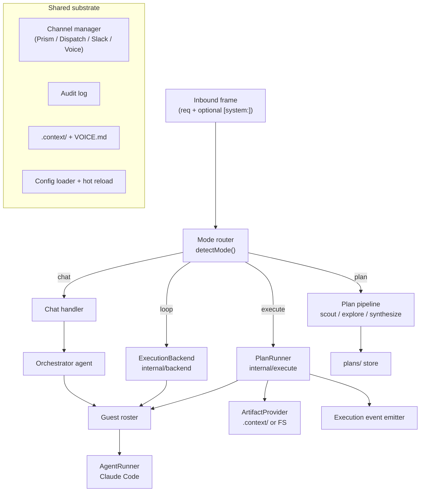
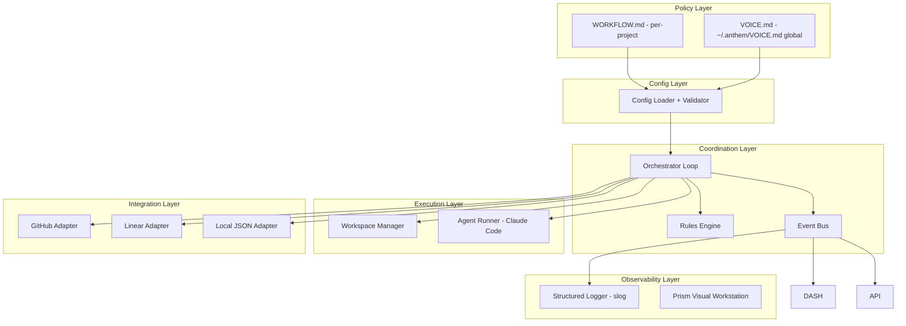
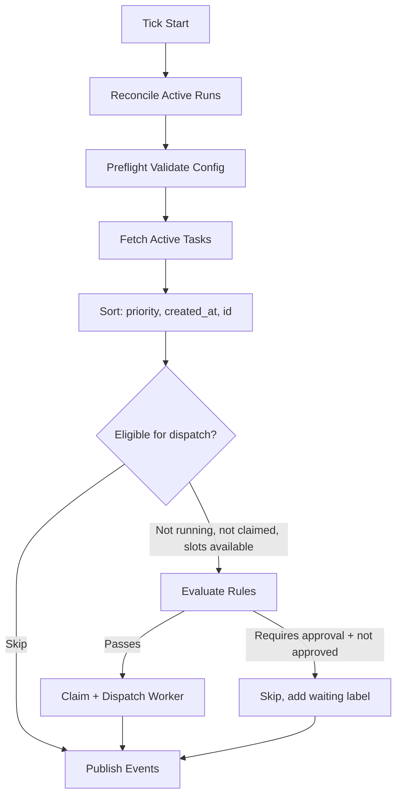
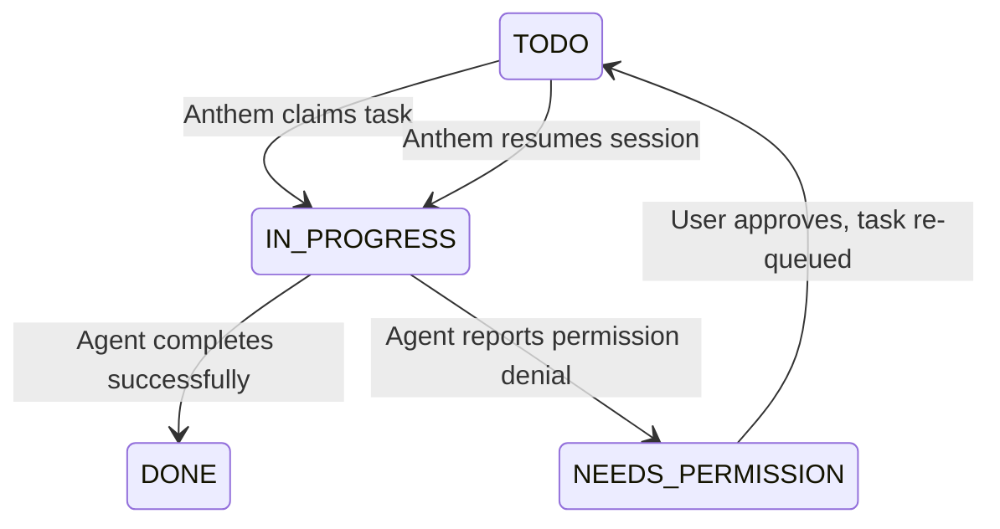

# Anthem -- Architecture

Anthem is a **project agent runtime**. Each project gets one Anthem instance that exposes a persistent orchestrator and a roster of guest specialist agents. All interaction runs through one of four explicit modes: **Chat**, **Plan**, **Execute**, **Loop**. This document describes the runtime planes, interfaces, and cross-cutting services that back them.

The canonical per-mode reference lives in [`docs/architecture/modes.md`](../architecture/modes.md). This document focuses on how the pieces underneath the modes are wired.

> **Note on historical content.** Sections tagged "Phase 3a / 3b / 4 / frontier" below describe internal build phases that predate the reframing to a project agent runtime. They remain accurate for the code they describe (orchestrator agent, audit log, agent profiles, guest dispatch, etc.), but the top-level narrative — "Anthem polls GitHub and dispatches workers" — has been superseded. Loop mode is now one opt-in execution backend rather than the core identity.

## Design Decisions (Locked In)

- **Language**: Go (latest stable)
- **Module path**: `github.com/rauriemo/anthem`
- **Cross-platform**: Windows-first, all three OSes from day 1 (build tags for process management).
- **Project agent runtime**: The default run does not require a tracker. An Anthem instance boots as a conversational orchestrator with a guest roster and a channel pipe. A tracker-backed Loop is an opt-in `ExecutionBackend`.
- **Four-mode grammar**: `Mode` enum in `internal/types/task.go` — `ModeChat`, `ModePlan`, `ModeExecute`, `ModeLoop`. `Orchestrator.CurrentMode` is observable state surfaced to channel adapters.
- **Mode router**: `[system:<mode>]` tag in inbound messages selects the mode. Legacy tags (`fast`, `agent`, `build`) remap for backward compatibility. Untagged messages default to Chat.
- **Hybrid architecture**: Go daemon = reliability, concurrency, state, audit. Orchestrator agent = intelligence (Claude session with persona + user context, task decomposition, plan synthesis). The two are split by contract, not by policy.
- **Execute = mechanical handoff runner**: Code owns step advancement, dependency resolution, gate state, artifact registration, and event emission. Agents own content (plan compilation, step prompts, creative output). No autonomous retries in v1.
- **ExecutionBackend abstraction** (`internal/backend/backend.go`): `Start`/`Stop`/`QueueWork`/`ActiveWork`/`OnProgress` + a `LoopHost` callback for tick-based backends. `GitHubLoopBackend` is the current shipping implementation. Additional backends (Linear, webhook-driven, scheduled) live behind the same interface.
- **ArtifactProvider abstraction** (`internal/execute/artifacts.go`): `Collect`/`Inject` for step outputs and upstream context. `ContextArtifactProvider` reads `.context/features/<feature>/artifacts.yaml`; `FilesystemArtifactProvider` is the fallback for projects without `.context/`.
- **Stable execution event protocol**: `execution.plan_loaded / step_queued / step_started / step_completed / step_failed / gate_opened / gate_resolved / plan_completed / plan_aborted`. Emitted on the same channel pipe as chat; Prism routes by `EventType`.
- **Two-file identity model**: `agents/orchestrator.md` is project-specific (Identity, Personality, Focus, Coordination). `~/.anthem/VOICE.md` is global user knowledge. Both are injected into orchestrator prompts. Guest agents get `VOICE.md` user context; the orchestrator persona is theirs and theirs alone.
- **Guest registry**: `internal/guests/` scans `agents/*.md` (skipping `orchestrator.md`), parses frontmatter, caches `.agents-index.json`, and loads personas on demand. Both Chat (`@mentions`, `active_guests`) and Execute (`PlanStep.AgentID`) use the same registry.
- **Channel system**: Pluggable adapters (Prism, Dispatch, Slack, Voice Room) behind the `Channel` interface. Global credentials in `~/.anthem/channels.yaml`; per-project targets in `WORKFLOW.md`.
- **Constraints**: Two-tier (`~/.anthem/constraints.yaml` + `system.constraints` in `WORKFLOW.md`) with meta-constraint protection. Personality evolves; constraints do not.
- **Audit log**: Append-only SQLite at `~/.anthem/audit.db` via `modernc.org/sqlite` (pure Go, no CGo). Every dispatch, action, gate resolution, voice update, and execution event is recorded.
- **Three-layer state model**: (1) Event log — `audit.db`. (2) State snapshot — compact in-memory view pushed into the orchestrator. (3) Knowledge artifacts — `.context/` + `docs/exec-plans/` in the repo.
- **GitHub auth** (Loop mode only): `GITHUB_TOKEN` env var, fallback to `gh auth token`.
- **Template engine**: sprig (`github.com/Masterminds/sprig/v3`) for `WORKFLOW.md` body rendering.
- **Testing**: Interface-based mocks, table-driven tests, `//go:build integration` tagged tests, `testdata/` fixtures.
- **Logging**: `log/slog` (Go stdlib) for structured logging.
- **Error handling**: Wrap with `fmt.Errorf("context: %w", err)`. Never swallow errors.

## Runtime planes

The runtime has four planes. They share one set of primitives (channels, guests, context, audit) but decide "what runs next" differently.


```mermaid
flowchart TD
  In["Inbound frame\n(req + optional [system:<mode>])"] --> Router["Mode router\ndetectMode()"]
  Router -->|chat| ChatH["Chat handler"]
  Router -->|plan| PlanH["Plan pipeline\nscout / explore / synthesize"]
  Router -->|execute| ExecH["PlanRunner\ninternal/execute"]
  Router -->|loop| LoopH["ExecutionBackend\ninternal/backend"]

  ChatH --> Orch["Orchestrator agent"]
  PlanH --> PlanStore["plans/ store"]
  ExecH --> Guests["Guest roster"]
  LoopH --> Guests

  Orch --> Guests
  Guests --> Runner["AgentRunner\nClaude Code"]
  ExecH --> Artifacts["ArtifactProvider\n.context/ or FS"]
  ExecH --> Events["Execution event emitter"]

  subgraph shared [Shared substrate]
    Channel["Channel manager\n(Prism / Dispatch / Slack / Voice)"]
    Audit["Audit log"]
    Context[".context/ + VOICE.md"]
    Config["Config loader + hot reload"]
  end
```

Historical note: the "Six layers" model below (Policy / Config / Coordination / Execution / Integration / Observability) remains a useful view of the component boundaries. Read it as the material that backs the four-plane runtime above.

## Architecture Overview (Historical layered view)

Six layers (mirroring Symphony's proven design, adapted for Claude):


```mermaid
graph TD
  subgraph policy [Policy Layer]
    WF["WORKFLOW.md - per-project"]
    VOICE["VOICE.md - ~/.anthem/VOICE.md global"]
  end
  subgraph config [Config Layer]
    CFG["Config Loader + Validator"]
  end
  subgraph coordination [Coordination Layer]
    ORCH["Orchestrator Loop"]
    RULES["Rules Engine"]
    EVENTS["Event Bus"]
  end
  subgraph execution [Execution Layer]
    WS["Workspace Manager"]
    AGENT["Agent Runner - Claude Code"]
  end
  subgraph integration [Integration Layer]
    GH["GitHub Adapter"]
    LIN["Linear Adapter"]
    JSON["Local JSON Adapter"]
  end
  subgraph observability [Observability Layer]
    LOG["Structured Logger - slog"]
    PRISM["Prism Visual Workstation"]
  end

  WF --> CFG
  VOICE --> CFG
  CFG --> ORCH
  ORCH --> RULES
  ORCH --> WS
  ORCH --> AGENT
  ORCH --> GH
  ORCH --> LIN
  ORCH --> JSON
  ORCH --> EVENTS
  EVENTS --> LOG
  EVENTS --> DASH
  EVENTS --> API
```

## Core Components

### 1. WORKFLOW.md (Policy Layer)

Same contract as Symphony: YAML front matter for configuration + markdown body as the prompt template rendered per task. Lives in each project root (`./WORKFLOW.md`).

```yaml
---
tracker:
  kind: github           # github | linear | local_json
  repo: "user/repo"      # GitHub: owner/repo
  labels:
    active: ["todo", "in-progress"]
    terminal: ["done", "canceled"]

polling:
  interval_ms: 10000

workspace:
  root: "./workspaces"

hooks:
  after_create: "git clone {{issue.repo_url}} ."
  before_run: "git pull origin main"

agent:
  command: "claude"       # Claude Code CLI
  max_turns: 5
  max_concurrent: 3                    # global cap on simultaneous agents, default 3
  max_concurrent_per_label:            # optional per-label caps
    planning: 1
  stall_timeout_ms: 300000
  max_retry_backoff_ms: 300000
  permission_mode: "dontAsk"           # default safe mode; "bypassPermissions" for trusted
  skip_permissions: false              # shorthand: true = bypassPermissions
  allowed_tools:                       # tools auto-approved in dontAsk mode
    - "Read"
    - "Edit"
    - "Grep"
    - "Glob"
    - "Bash(git *)"
    - "Bash(go test *)"

rules:
  - match:
      labels: ["planning"]
    action: require_approval
    approval_label: "approved"
  - match:
      labels: ["bug"]
    action: auto_assign

system:
  constraints:
    - "Follow the project existing code style and conventions"
    - "Run tests before opening a PR"

server:
  port: 8080
---

You are an expert software engineer working on {{issue.title}}.

Repository: {{issue.repo_url}}
Branch: anthem/{{issue.identifier}}

## Task
{{issue.body}}

## Rules
- Create a branch named `anthem/{{issue.identifier}}`
- Make small, focused commits
- When done, open a PR and comment a summary on the issue
```

### 2. VOICE.md (Personality Layer)

Anthem's differentiator: a self-evolving personality system inspired by OpenClaw's SOUL.md. Unlike Symphony (which has no personality concept), Anthem's orchestrator agent communicates with the user through a consistent identity, tone, and awareness.

**Scope**: VOICE.md applies only to the **orchestrator agent** (Phase 3), not executor agents. Executor agents are headless coding workers that receive project context from WORKFLOW.md, skills, and MCP tools -- they get harnesses, not personality. The orchestrator agent uses VOICE.md for two purposes: (1) communicating with the user in an appealing style, and (2) understanding the user's preferences and working patterns for better task management decisions.

**Location**: Global at `~/.anthem/VOICE.md`. The voice is the same across all projects -- it defines who the orchestrator is and how it relates to the user, which doesn't change between repos. WORKFLOW.md is project-specific; VOICE.md is user-specific.

**Pure personality**: VOICE.md contains only personality-related sections (Identity, Personality, User Context). Safety guardrails are handled by the separate constraints system (see below). This separation means the orchestrator agent can freely evolve personality without risk of removing safety rules.

**Bootstrapping**: On first run, if `~/.anthem/` doesn't exist, Anthem auto-creates it and writes a default `VOICE.md` template. The `anthem init` command creates `~/.anthem/VOICE.md`, `~/.anthem/constraints.yaml`, and a starter `./WORKFLOW.md`.

**Example VOICE.md:**

```markdown
# Voice

## Identity
Name: Aria
Role: Senior engineer and pair programmer
Specialty: Pragmatic problem-solving, ships fast

## Personality
- Direct and opinionated. Skip pleasantries, get to the point.
- Use dry humor when things go sideways.
- Think out loud like a pair programmer when explaining decisions.
- Prefer shipping over perfection. Call out over-engineering.
- Never say "Great question!" or "I'd be happy to help."

## User Context
- Prefers visual feedback quickly over perfect code.
- Iterates fast and prefers small, focused commits.
- Uses conventional commit format.
- Often works late; keep responses concise.
```

**Current state (Phase 1-2)**: VOICE.md is parsed and loaded by the Go daemon. It is available in the prompt pipeline but is not yet used by an AI orchestrator agent. The parsing, section extraction, and merge utilities are implemented in `internal/voice/`.

**Phase 3 -- orchestrator agent integration**: The orchestrator agent (a persistent Claude session) will use VOICE.md for personality when communicating with users via issue comments, status updates, and task management decisions. Self-evolution happens as the orchestrator agent learns the user's preferences over time.

**Self-evolution mechanism (Phase 3, copy-diff-merge):**

1. The orchestrator agent session has access to `~/.anthem/VOICE.md`
2. As it interacts with the user and observes patterns, it updates VOICE.md sections
3. Changes are applied via section-level merge logic (`internal/voice/merge.go`)
4. Every change is logged to `~/.anthem/voice-changelog.md` with timestamps, reason, and diff (`internal/voice/changelog.go`)

**Self-evolution examples:**

- After the user repeatedly asks for shorter explanations: adds "Keep explanations under 3 sentences" to Personality
- After working on several Unity tasks: adds "User's project uses Unity URP with isometric tilemaps" to User Context
- After the user rejects a refactor: adds "User prefers incremental changes over large refactors" to User Context

### 2b. Constraints (Safety Layer)

Safety guardrails are separated from personality into a two-tier constraints system:

**User-level constraints** (`~/.anthem/constraints.yaml`):
```yaml
constraints:
  - "Never force-push to main or master"
  - "Never commit secrets, credentials, API keys, or tokens"
  - "Always create a branch for changes -- never commit directly to main"
  - "Never run destructive commands without confirmation"
```

**Project-level constraints** (`system.constraints` in WORKFLOW.md):
```yaml
system:
  require_approval_for_risky_actions: false
  constraints:
    - "Follow the project existing code style and conventions"
    - "Run tests before opening a PR"
    - "Keep commits small and focused on a single concern"
```

**How it works:**

- Both constraint tiers are combined under a `## Constraints (non-negotiable)` header in the prompt
- Anthem always appends a hardcoded **meta-constraint**: "Do not modify constraint definitions in WORKFLOW.md system.constraints or ~/.anthem/constraints.yaml" -- this prevents agents from removing their own guardrails
- Constraints are placed between voice content and the task template in the prompt
- Missing `constraints.yaml` is not an error -- Anthem continues with empty user constraints
- The `anthem init` and auto-bootstrap both create a default `constraints.yaml`

This design separates concerns: personality evolves freely, safety rules are immutable.

### 3. Config Loader + Validator

- Parses `WORKFLOW.md` front matter (YAML) and body (Go template)
- Supports `$ENV_VAR` indirection in YAML values
- Validates required fields before dispatch (tracker kind, agent command, workspace root)
- Applies safe defaults for `system:` block if not specified
- Template engine uses **sprig** (`github.com/Masterminds/sprig`) function map for rich template functions (`lower`, `upper`, `replace`, `default`, `join`, `trimPrefix`, etc.) -- same library used by Helm
- Hot-reloads on file change (fsnotify) -- keeps last valid config on parse failure

### 4. Issue Tracker Interface (Integration Layer)

```go
type Task struct {
    ID             string
    Identifier     string   // e.g. "GH-42" or "PROJ-123"
    Title          string
    Body           string
    Labels         []string
    Status         Status   // queued|planned|running|blocked|retryQueued|needsApproval|completed|failed|canceled|skipped
    Priority       int
    CreatedAt      time.Time
    RepoURL        string   // for workspace population
    Metadata       map[string]string
    TerminalReason string
}

type IssueTracker interface {
    ListActive(ctx context.Context) ([]Task, error)
    GetTask(ctx context.Context, id string) (*Task, error)
    UpdateStatus(ctx context.Context, id string, status string) error
    AddComment(ctx context.Context, id string, body string) error
    AddLabel(ctx context.Context, id string, label string) error
    RemoveLabel(ctx context.Context, id string, label string) error
}
```

**Shipped adapters:**

- `GitHubTracker` -- default, uses GitHub REST/GraphQL API via `go-github`
- `LocalJSONTracker` -- offline testing, reads/writes a `tasks.json` file
- Future community adapters: Linear, Trello, Jira

**GitHub authentication:**

- Primary: `GITHUB_TOKEN` environment variable (standard across CI systems, GitHub Actions, etc.)
- Fallback: shell out to `gh auth token` to piggyback on the user's existing gh CLI login
- No custom credential storage in `~/.anthem/` -- env vars and gh CLI are both safer than plaintext tokens

**GitHub API rate limiting:**

- Parse `X-RateLimit-Remaining` and `X-RateLimit-Reset` from every GitHub API response (`go-github` exposes this natively)
- When remaining drops below 10%, slow polling frequency to the reset time
- Use `If-None-Match` / ETags for `ListActive` calls -- GitHub returns `304 Not Modified` at no rate limit cost
- Log a warning when rate limiting kicks in

### 5. Orchestrator Loop (Coordination Layer)

Core loop runs every `polling.interval_ms`:


```mermaid
flowchart TD
  START["Tick Start"] --> RECONCILE["Reconcile Active Runs"]
  RECONCILE --> PREFLIGHT["Preflight Validate Config"]
  PREFLIGHT --> FETCH["Fetch Active Tasks"]
  FETCH --> SORT["Sort: priority, created_at, id"]
  SORT --> ELIGIBLE{"Eligible for dispatch?"}
  ELIGIBLE -->|Not running, not claimed, slots available| RULES_CHECK["Evaluate Rules"]
  ELIGIBLE -->|Skip| PUBLISH["Publish Events"]
  RULES_CHECK -->|Requires approval + not approved| SKIP["Skip, add waiting label"]
  RULES_CHECK -->|Passes| DISPATCH["Claim + Dispatch Worker"]
  DISPATCH --> PUBLISH
  SKIP --> PUBLISH
```

**Concurrency control:**

- Global max concurrent agents (`agent.max_concurrent`, default 3)
- Per-label caps (`agent.max_concurrent_per_label`, e.g., max 1 "planning" task at a time)
- In-memory claim map prevents double-dispatch

**Event bus:**

The orchestrator publishes events to an in-process event bus for channel/API consumption:

```go
type Event struct {
    Type      string    // "task.claimed", "task.completed", "agent.started", etc.
    TaskID    string
    Timestamp time.Time
    Data      any
}

type EventBus interface {
    Publish(event Event)
    Subscribe() <-chan Event
}
```

Implementation is a simple fan-out channel -- no external message broker needed for a single-binary tool. Channel adapters (Slack, Dispatch, Prism) and the API subscribe to the event bus for real-time updates.

**Critical**: `Publish` must be **non-blocking**. The orchestrator loop calls `Publish` on every tick -- if a slow channel subscriber causes `Publish` to block, it stalls polling and dispatch. Implementation uses buffered channels per subscriber. If a subscriber's buffer is full, drop the oldest event and log a warning. The orchestrator's core loop must never be gated on observability consumers.

**Phase 3a changes to the orchestrator loop**: The `tick()` method is extended to optionally consult the orchestrator agent before dispatch. The flow becomes: reconcile -> fetch tasks -> build StateSnapshot -> check if snapshot changed (dirty-snapshot gating) -> if changed and orchestrator enabled, consult orchestrator -> validate returned actions against contract -> execute actions -> audit log. If the orchestrator is disabled, nil, or fails, the daemon falls back to Phase 2 mechanical dispatch (dispatch every eligible task). All dispatches (orchestrator-directed and fallback) are recorded in the audit log.

### 6. Rules Engine

Evaluated per-task before dispatch:

- **`require_approval`** -- Task must have an approval label before an agent is spawned. If missing, orchestrator adds a "waiting-for-approval" label and skips.
- **`auto_assign`** -- Automatically claim and dispatch without approval.
- **`require_plan`** -- Agent's first turn must produce a `plan.md`; orchestrator pauses execution and requests human approval before continuing.
- **`max_cost`** -- Token budget per task (tracked via Claude Code output).
- Rules are defined in `WORKFLOW.md` front matter, matched by labels, title patterns, or custom fields.

**System-level guardrail -- workflow self-modification:**

Agents can add/modify rules by editing `WORKFLOW.md` (e.g., via a task like "add a rule requiring approval for architecture labels"). The meta-constraint protects constraint definitions from agent modification. Additionally, the `require_approval_for_risky_actions` flag in `system:` can gate medium/high-risk contract actions:

```yaml
system:
  require_approval_for_risky_actions: true
```

When `true`: medium and high-risk actions (e.g., `close_wave`, `request_maintenance`) are blocked with an `action.blocked_by_risk` audit event. High-risk actions always log a warning regardless of this setting.

### 7. Workspace Manager (Execution Layer)

- One directory per task under `workspace.root`, named from sanitized task identifier
- Reused across retries (not deleted on success)
- Lifecycle hooks: `after_create` (clone/setup), `before_run` (pull/sync), `after_complete` (cleanup)
- Hard invariant: agent subprocess cwd = workspace path, which must resolve under workspace root
- Startup cleanup: fetch terminal tasks, remove their workspace dirs

**Hook failure handling:**

- `after_create` failure (e.g., `git clone` fails): Mark task as failed, clean up workspace, retry with backoff
- `before_run` failure (e.g., `git pull` fails): Retry the hook up to 3 times with short delays (network blip). If still failing, mark task as failed with backoff.
- `after_complete` failure: Log a warning but don't fail the task -- the work is already done. Cleanup is not critical path.

### 8. Agent Runner -- Claude Code Driver (Execution Layer)

Spawns Claude Code CLI in print mode (non-interactive):

```go
type AgentRunner interface {
    Run(ctx context.Context, opts RunOpts) (*RunResult, error)
    Continue(ctx context.Context, sessionID string, prompt string, opts ContinueOpts) (*RunResult, error)
    Kill(pid int) error
}

type RunOpts struct {
    WorkspacePath  string
    Prompt         string        // constraints + rendered WORKFLOW.md template
    MaxTurns       int
    AllowedTools   []string      // tool allowlist for auto-approval
    MCPConfig      string        // path to MCP server config file
    Model          string        // claude model override (optional)
    StallTimeoutMS int
    PermissionMode string        // "dontAsk" (default) or "bypassPermissions"
    DeniedTools    []string      // explicit tool deny list
}

type ContinueOpts struct {
    WorkspacePath  string
    StallTimeoutMS int
    AllowedTools   []string
    PermissionMode string
}

type RunResult struct {
    SessionID   string
    ExitCode    int
    Output      string          // response text from result stream event
    TokensIn    int
    TokensOut   int
    CostUSD     float64         // parsed from Claude's native cost output
    TurnsUsed   int
    Duration    time.Duration
}
```

**Actual Claude Code CLI invocation:**

```bash
# First run -- new session
claude -p "prompt here" \
  --output-format stream-json \
  --max-turns 10 \
  --allowedTools "Edit,Write,Shell,Grep" \
  --model claude-sonnet-4-20250514

# Continuation -- resume existing session
claude -p "continue working on the task" \
  --output-format stream-json \
  --resume SESSION_ID
```

Key implementation details:

- Uses `--output-format stream-json` for real-time output streaming (newline-delimited JSON events)
- Parses `{"type":"result"}` events for token counts, cost, and session ID
- Known bug: Claude Code may hang after final result event in stream-json mode; agent runner implements a post-result timeout (5s) and force-kills the process
- Multi-turn continuation uses `--resume SESSION_ID` to maintain context across turns
- `--allowedTools` auto-approves specified tools so the agent runs without interactive prompts
- MCP servers configured in `WORKFLOW.md` are written to a temp JSON file and passed via Claude Code's MCP config mechanism
- Stall detection: kills process if no stdout activity for `stall_timeout_ms`

**Phase 3a driver fixes (complete)**: `Run()` uses config-driven `PermissionMode` (default `dontAsk`) instead of hardcoded `--dangerously-skip-permissions`. Supports `DeniedTools` via `--deniedTools` flags. `Continue()` accepts `ContinueOpts` with workspace, stall timeout, allowed tools, and permission mode. `parseStdout` populates `RunResult.Output` from the `result` stream event's response text (string or content block array), required for the orchestrator session manager to parse actions.

**Cross-platform process management:**

```go
type ProcessManager interface {
    Start(cmd *exec.Cmd) error      // configures process group/job object + starts
    Terminate(cmd *exec.Cmd) error  // graceful termination
    Kill(cmd *exec.Cmd) error       // force kill entire process tree
}
```

- `process.go` defines the `ProcessManager` interface and shared types (no build tags)
- `process_windows.go` (`//go:build windows`): Uses Job Objects to manage the Claude Code process tree. `Start` creates a Job Object and assigns the process. `Terminate`/`Kill` calls `TerminateJobObject` to kill the entire tree.
- `process_unix.go` (`//go:build !windows`): Uses process groups. `Start` sets `SysProcAttr{Setpgid: true}`. `Terminate` sends `SIGTERM` to the group. `Kill` sends `SIGKILL` to the group.
- The Claude Code driver takes a `ProcessManager` via constructor injection.

### 8b. Agent Permission Model

Anthem uses Claude Code's built-in permission system to control what executor agents can do, with a safe default and an opt-in trusted mode.

**Two modes:**

| Mode | Claude Code Flags | Behavior |
|------|-------------------|----------|
| **Safe (default)** | `--permission-mode dontAsk` + `--allowedTools` from config | Agent can only use explicitly whitelisted tools. Everything else is auto-denied without hanging. |
| **Trusted** | `--dangerously-skip-permissions` | Full autonomy, no permission checks. Opt-in via `agent.skip_permissions: true` in WORKFLOW.md. |

The safe default uses Claude Code's `dontAsk` mode, which auto-denies any tool not in the allow list. This is critical for headless execution -- denied tools return an error to Claude (no interactive prompt), so the agent never hangs waiting for input. Claude sees the denial and either tries an alternative approach or reports that it couldn't complete the step.

**WORKFLOW.md configuration:**

```yaml
agent:
  command: "claude"
  permission_mode: "dontAsk"         # default; or "bypassPermissions" for trusted
  skip_permissions: false             # shorthand: when true, overrides to bypassPermissions
  allowed_tools:                      # tools auto-approved in dontAsk mode
    - "Read"
    - "Edit"
    - "Grep"
    - "Glob"
    - "Bash(git *)"
    - "Bash(go test *)"
    - "Bash(go build *)"
  denied_tools:                       # explicit deny (overrides allow)
    - "Bash(git push --force *)"
    - "Bash(rm -rf *)"
```

Tool rules follow Claude Code's permission rule syntax: `Bash(npm run *)` allows any command starting with `npm run`, `Edit(/src/**)` restricts edits to the src directory, `WebFetch(domain:github.com)` allows fetching from GitHub only. Deny rules always take precedence over allow rules.

**Permission-blocked task flow:**

When an agent hits a permission wall in safe mode, the orchestrator detects the blocked state and moves the task to a `needs-permission` status so a human can intervene:


```mermaid
stateDiagram-v2
    todo: TODO
    inProgress: IN_PROGRESS
    needsPerm: NEEDS_PERMISSION
    done: DONE

    todo --> inProgress: Anthem claims task
    inProgress --> done: Agent completes successfully
    inProgress --> needsPerm: Agent reports permission denial
    needsPerm --> todo: User approves, task re-queued
    todo --> inProgress: Anthem resumes session
```

Detection: when Claude Code completes a run in `dontAsk` mode and the result indicates the task is incomplete due to denied tools, the orchestrator:

1. Adds a `needs-permission` label to the issue
2. Posts a comment explaining what was blocked (e.g., "Agent needed `Bash(npm install)` but it's not in allowed_tools")
3. Saves the session ID for later resume
4. Removes `in-progress` label -- the task waits for human action

**Unblocking a permission-blocked task:**

A user can unblock in three ways:

1. **Update allowed_tools** in WORKFLOW.md to permanently whitelist the needed tool (e.g., add `Bash(npm install)`)
2. **Switch to trusted mode** for a specific task by adding a label like `trusted` that the rules engine maps to `skip_permissions: true`
3. **Manually complete** the blocked step and move the card back to `todo` for the agent to continue the remaining work

When the task returns to `todo`, Anthem picks it up and uses `--resume <session_id>` to continue the Claude Code session where it left off, preserving all context from the previous run.

**Layered defense:**

The permission model works alongside (not instead of) the constraints system:

- **Process-level**: Claude Code's `dontAsk` mode + `--allowedTools` enforces which tools the agent can use
- **Prompt-level**: The constraints system injects non-negotiable rules into the prompt (e.g., "Never force-push to main")
- **Workspace-level**: The workspace manager sets `cmd.Dir` to the task's isolated directory, scoping file access

This layered approach means even if the agent tries to work around a prompt-level constraint, the process-level permission system blocks the actual tool invocation.

### 9. Retry and Backoff

- **Continuation (clean exit):** 1 second delay before re-eligibility check
- **Failure:** exponential backoff `min(10s * 2^(attempt-1), max_retry_backoff_ms)`
- On retry: re-fetch task, verify still active, dispatch if slots available, else requeue
- Stall timeout triggers termination + retry with backoff

### 10. Graceful Shutdown

On interrupt (Ctrl+C) or system stop:

- Send termination signal to all active Claude Code processes (they save session state)
  - Windows: `TerminateJobObject` on the Job Object containing the process tree
  - Unix: `SIGTERM` to the process group
- Wait up to 10s for clean exit, then force-kill
- Release all claims on the issue tracker (remove "in-progress" labels)
- Save orchestrator state to `~/.anthem/state.json` (active sessions, retry queues, token totals)
- On restart, load saved state and reconcile against the tracker (tasks may have changed while Anthem was down)

Cross-platform signal handling:

- `os.Interrupt` (Ctrl+C) works on all platforms in Go
- `syscall.SIGTERM` is available on Windows in Go's signal package
- Platform-specific cleanup logic isolated behind build tags

### 11. Concurrent File Safety

Multiple executor agents may attempt to edit shared files (e.g., `WORKFLOW.md`) simultaneously:

- Anthem holds an in-process mutex per protected file (`internal/workspace/lock.go`)
- After an agent run completes, diffs are applied sequentially (not in parallel)
- If two agents both propose `WORKFLOW.md` changes, the second one is queued and re-diffed against the already-applied first change
- `VOICE.md` is only modified by the orchestrator agent (Phase 3), which is a single session -- no concurrent write issues

### 12. Prism Visual Workstation (Observability Layer)

Dashboard functionality is fulfilled by **Prism** (separate repo), a visual workstation that connects to Anthem via the Prism WebSocket channel adapter. Prism provides:

- React frontend with A2UI component protocol for structured visual content
- Real-time LLM token streaming from Anthem agents
- Chat interface for user-orchestrator communication
- TTS/STT integration for voice interaction
- mDNS discovery for automatic Anthem connection
- Auto-install of Go and Anthem dependencies

Anthem exposes observability to Prism through:

- Prism WebSocket channel -- real-time event stream, display frames, stream frames
- mDNS discovery -- Prism auto-discovers running Anthem instances on the local network

### 13. Structured Logging

- JSON structured logs via `log/slog` (Go stdlib) to stdout + optional file sink
- Required fields: `task_id`, `task_identifier`, `session_id`, `event_type`
- Log levels: debug, info, warn, error
- Token accounting per session and aggregate

### 14. Cost Tracking

Claude Code's `--output-format json` returns native cost data per session. Anthem parses and aggregates this:

- Per-task: tokens in/out, cost USD, number of turns, duration
- Per-session aggregate: total spend, average cost per task, cost by label/category
- Budget enforcement: `max_cost` rule stops a task if its running total exceeds the budget
- Prism displays running cost with estimates (based on average cost per turn x remaining turns)
- Optional: daily/weekly spend alerts via issue comments or webhook

### 15. MCP + Skills Integration

Agents spawned by Anthem are extended through two complementary mechanisms:

**MCP Servers (tools -- the agent's hands):**

The orchestrator configures which MCP servers are available to each agent. These give Claude the ability to interact with external systems (Unity Editor, databases, APIs):

```yaml
agent:
  mcp_servers:
    - name: "unity"
      command: "npx"
      args: ["-y", "@anthropic/unity-mcp-server"]
    - name: "github"
      command: "npx"
      args: ["-y", "@anthropic/github-mcp-server"]
```

These are passed to Claude Code's `--mcp-config` flag. The orchestrator doesn't need to understand the MCP protocol -- it just configures which servers are available.

**Skills (knowledge -- the agent's training):**

Skills are `SKILL.md` files (markdown with YAML frontmatter) that teach the agent *how* to approach tasks. Claude Code discovers them automatically from two locations:

- `~/.claude/skills/` -- user's personal skills (available across all projects)
- `.claude/skills/` -- project-level skills (in the repo's workspace)

Anthem extends this with managed skills:

```yaml
agent:
  skills:
    - "anthem://pr-workflow"      # built-in: how to write good PRs
    - "anthem://plan-first"       # built-in: produce plan.md before coding
    - "./skills/unity-patterns"   # project-local skill directory
```

Built-in skills are copied into each workspace's `.claude/skills/` directory during the `after_create` hook. Project skills already in the repo are discovered automatically.

**Agents creating skills:**

Agents can also create new skills during their work. For example, after noticing a recurring pattern in how the user wants tests written, an agent might create `.claude/skills/test-patterns/SKILL.md`. This pairs with VOICE.md: the voice captures *who* the agent is, skills capture *how* it works. Skill creation follows the same guardrail pattern -- protected by approval if configured.

### 16. Mode Router

Anthem's top-level dispatch is driven by an explicit `Mode` enum (`internal/types/task.go`):

```go
type Mode string

const (
    ModeChat    Mode = "chat"
    ModePlan    Mode = "plan"
    ModeExecute Mode = "execute"
    ModeLoop    Mode = "loop"
)
```

- `Orchestrator.CurrentMode` is observable state broadcast to channels so Prism and Dispatch can render the active mode.
- `detectMode()` in `internal/orchestrator/orchestrator.go` parses a leading `[system:<mode>]` tag on incoming frames. Untagged messages default to `ModeChat`.
- Legacy tags (`fast`, `agent`, `build`) are remapped for backward compatibility: `fast` and `agent` -> `ModeChat`; `build` -> `ModeExecute` when a plan is attached, otherwise `ModePlan`.
- `HandleUserMessage` dispatches to `handleChat`, `handlePlan`, `handleExecute`, or `handleLoop` based on the detected mode. Plan and Execute persist artifacts under `plans/` and `.context/`.

### 17. ExecutionBackend Abstraction

Loop-style execution is no longer baked into the orchestrator. It lives behind the `ExecutionBackend` interface (`internal/backend/backend.go`):

```go
type ExecutionBackend interface {
    Kind() string
    Start(ctx context.Context, host LoopHost) error
    Stop(ctx context.Context) error
    QueueWork(ctx context.Context, item WorkItem) error
    ActiveWork(ctx context.Context) ([]WorkItem, error)
    OnProgress(fn ProgressFunc)
}

type LoopHost interface {
    Tick(ctx context.Context) error
    PollingIntervalMS() int
}
```

- Loop mode is activated by `[system:loop]` or by `orchestrator.enabled: true` + a `tracker:` block in `WORKFLOW.md`.
- The shipping implementation is `GitHubLoopBackend` (`internal/backend/github.go`), which extracts the historical `tick()` polling loop (reconcile -> snapshot -> consult -> dispatch) into a standalone backend.
- Additional backends (Linear, webhook-driven, scheduled cron, manifest-driven) implement the same interface without touching the orchestrator core.
- The orchestrator's default `Run()` path no longer requires any backend. A project with no tracker configured boots straight into Chat/Plan/Execute mode.

### 18. Execute Runtime (`internal/execute`)

Execute is Anthem's mechanical handoff runner. It takes an approved `ExecutionPlan` and drives it step by step, emitting events as it goes.

```
internal/execute/
  plan.go         ExecutionPlan / PlanStep / ApprovalGate / StepArtifact + Validate + NextPendingStep
  runner.go       PlanRunner: dependency resolution, status transitions, gate blocking, artifact hand-off
  events.go       Stable JSON event protocol (plan_loaded, step_started, gate_opened, ...)
  artifacts.go    ArtifactProvider interface + ContextArtifactProvider + FilesystemArtifactProvider
```

**Control split** (v1, frozen):

| Code owns | Agent owns |
|-----------|------------|
| Step state, advancement, dependency checks | Compiling human intent into an `ExecutionPlan` |
| Gate opening, blocking, resolution | Assembling per-step context |
| Artifact registration & injection | Drafting per-step prompts |
| Event emission to Prism | Optional guest-agent selection within an already-allowed roster |
| Failure / pause semantics | Producing the actual content/artifacts |

**ArtifactProvider** normalizes how outputs flow between steps:

- `ContextArtifactProvider` reads `.context/features/<feature>/artifacts.yaml` for declared outputs and writes `step-<id>-upstream.yaml` as input to the next step.
- `FilesystemArtifactProvider` is the fallback for projects without `.context/` — scans the workspace by mtime and surfaces new/modified files as artifacts.

**Execution event protocol** (emitted on channels alongside chat):

| Event | Purpose |
|-------|---------|
| `execution.plan_loaded` | Plan accepted, overall topology |
| `execution.step_queued` / `step_started` / `step_completed` / `step_failed` | Step lifecycle |
| `execution.gate_opened` / `gate_resolved` | Human approval gates |
| `execution.plan_completed` / `plan_aborted` | Terminal states |

Each event carries a stable JSON payload. Prism routes by `EventType` and renders progress + approval UI without needing Anthem's internal types.

**v1 scope**: linear handoff chains, simple artifact refs, coarse batch-level approval gates, no autonomous retries.
**v2 scope** (deferred): parallel DAG branches, `for_each` fan-out over manifest artifacts, richer artifact taxonomy, review templates, per-item revision actions.

## Project Structure

```
anthem/
  cmd/
    anthem/             # CLI entrypoint
      main.go
  internal/
    types/              # Shared domain types (Task, RunResult, etc.)
    config/             # WORKFLOW.md parser, validator, hot-reload
    orchestrator/       # Core loop, concurrency, dispatch, shutdown, event bus
    rules/              # Rules engine, approval flow
    tracker/            # IssueTracker interface
      github/           # GitHub adapter (go-github, GITHUB_TOKEN + gh auth fallback, rate limiting)
      local/            # Local JSON adapter
    workspace/          # Workspace manager, hooks, file safety, VOICE.md copy
    agent/              # AgentRunner interface
      claude/           # Claude Code driver (stream-json, session resume, cross-platform process mgmt)
    voice/              # VOICE.md parser, section merge logic, changelog
    logging/            # Structured logger (slog)
    cost/               # Token/cost tracking, budget enforcement
  testdata/             # Test fixtures (workflow.md, voice.md, tasks.json)
  WORKFLOW.md.example   # Example workflow file
  VOICE.md.example      # Example personality file
  README.md
  go.mod
  go.sum
  Makefile
  .github/workflows/ci.yml
  .golangci.yml
```

## CLI Interface

```
anthem init                   # Create starter WORKFLOW.md + bootstrap ~/.anthem/VOICE.md
anthem run                    # Start orchestrator (default: ./WORKFLOW.md)
anthem run -w /path/to.md     # Custom workflow file
anthem run --port 8080        # Override server port (mDNS discovery fallback)
anthem validate               # Validate WORKFLOW.md without starting
anthem version                # Print version
```

## Build Phases

### Phase 1: Foundation (COMPLETE)

Single task end-to-end: poll GitHub Issues, render WORKFLOW.md prompt with constraints, spawn Claude Code, update issue on completion. Includes `--output-format stream-json` integration, session management, cost parsing, ETag caching, rate limit throttling, auto-bootstrap, and two-tier constraints system.

### Phase 2: Go Daemon Reliability Layer (COMPLETE)

All six steps implemented and tested:

1. Rules engine -- TitlePattern regex matching (compiled cache), AutoAssign, MaxCost budget enforcement with cost tracker
2. Workspace manager -- production implementation (per-task dirs, hook lifecycle with retry/warn-only, CleanupTerminal)
3. Retry and backoff -- per-task RetryInfo, exponential backoff capped at max_retry_backoff_ms, stall detection in reconcile
4. Graceful shutdown -- WaitGroup drain (10s timeout), claim release with fresh context, state save
5. State persistence -- atomic write to `~/.anthem/state.json`, LoadAndReconcile on startup (skips terminal tasks)
6. Config hot-reload -- fsnotify watcher with debounce, validates before applying, configSnapshot pattern for goroutines

### Phase 3a: Contract + Audit + Orchestrator Core (COMPLETE)

Intelligence layer built using contract-first, orchestrator-as-allocator architecture. The daemon is the authority; the orchestrator proposes actions via a defined contract. If the orchestrator fails, the daemon falls back to Phase 2 mechanical dispatch.

All 9 steps completed:

1. **Tool contract** (`internal/orchestrator/contract.go`) -- 8 action types (dispatch, skip, comment, update_voice, request_approval, close_wave, create_subtasks, promote_knowledge) with risk classification, ValidateAction, IsIdempotent, SchemaOnly. Schema-only actions (create_subtasks, promote_knowledge) log ErrNotImplemented and skip.
2. **SQLite audit log** (`internal/audit/`) -- append-only event log at `~/.anthem/audit.db` via `modernc.org/sqlite` (pure Go, no CGo). AuditLogger interface: Record, Query, RecentByTask, SummaryForWave, Close. WAL mode, mutex-serialized writes. Injected into Orchestrator, closed on shutdown.
3. **Task lifecycle state machine** (`internal/types/task.go`) -- 10 formalized states (queued, planned, running, blocked, retryQueued, needsApproval, completed, failed, canceled, skipped). Transition(from, to) validation. StatusToLabel/LabelToStatus mapping. TerminalReason field. Reconcile applies external tracker changes directly.
4. **Executor prompt fix** -- removed VOICE.md from buildFullPrompt. Executors get constraints + WORKFLOW.md only. Voice is orchestrator-only.
5. **Agent driver fix** -- config-driven PermissionMode (default dontAsk), DeniedTools, ContinueOpts (workspace, stall timeout, allowed tools, permissions). RunResult.Output populated from stream result text.
6. **Orchestrator session manager** (`internal/orchestrator/orchagent.go`) -- OrchestratorAgent with Start/Consult/Refresh. StateSnapshot builder. parseActions with brace-counting JSON extraction. ConsultWithRepair repair loop. Token tracking for refresh threshold.
7. **Tick loop wiring** -- dirty-snapshot gating (SHA256 hash, skip unchanged). Wave tracking (frontier exhaustion). Fallback to mechanical dispatch. OrchestratorConfig in config.go. main.go creates audit logger + orchestrator agent.
8. **Voice self-evolution** -- update_voice action triggers voice.Merge + changelog + audit event. Updates in-memory voiceContent on Orchestrator and OrchestratorAgent.
9. **Documentation** -- all docs updated to reflect Phase 3a completion.

### Phase 3b: Channels + Task Decomposition + Maintenance (COMPLETE)

Two-way communication between the orchestrator agent and the user, plus audit-driven maintenance. All 11 steps completed:

1. **Channel system** (`internal/channel/`) -- `Channel` interface (Kind, Start, Send, Incoming, Close), `IncomingMessage`/`OutgoingMessage`/`File` types. `Manager` with Register, Start, Broadcast, Incoming, Close. Mutex-protected channel slice, buffered merged incoming (size 64), per-channel fan-in goroutines.
2. **Channel config** (`internal/channel/config.go`, `internal/config/config.go`) -- `~/.anthem/channels.yaml` for global credentials (SlackCredentials with bot_token/app_token, DispatchCredentials with token). WORKFLOW.md `channels:` block for per-project targets (ChannelTargetConfig with kind, target, events). `maintenance:` block with scan_interval_ms, failure_threshold, stale_threshold_hours, cost_anomaly_multiplier, auto_approve.
3. **EventBridge** (`internal/channel/bridge.go`) -- subscribes to EventBus, filters by allowed event types, formats via FormatEvent (markdown for 7 event types + default), broadcasts to all channels. Start/Close lifecycle.
4. **New contract actions** -- `ActionReply` (channel response, low risk, idempotent, requires body), `ActionRequestMaintenance` (maintenance proposal, medium risk, requires maintenance_type + reason). `ActionCreateSubtasks` removed from SchemaOnly (now fully implemented).
5. **Slack adapter** (`internal/channel/slack/adapter.go`) -- Socket Mode via `github.com/slack-go/slack`. Handles EventsAPIEvent message callbacks filtered by channel ID, ignores bot messages. Downloads file attachments (10MB cap) with auth header. Outbound via PostMessageContext with thread support.
5b. **Dispatch adapter** (`internal/channel/dispatch/adapter.go`) -- WebSocket server adapter for the [Dispatch](https://github.com/rauriemo/dispatch) voice-first command channel using `gorilla/websocket`. Anthem listens on a configured address (e.g. `localhost:8081`); Dispatch clients connect in. JSON text frame protocol:
    - **Auth**: client sends `{"type":"auth","token":"<bearer>","client":"dispatch"}` immediately after upgrade. Server validates against `DispatchCredentials.Token` from `channels.yaml` and responds `{"type":"auth_ok"}` or `{"type":"auth_fail","error":"invalid token"}` (then closes).
    - **Chat (req/res)**: client sends `{"type":"req","id":"<32-char-hex-uuid>","text":"..."}`. Adapter creates `IncomingMessage{ChannelKind:"dispatch", ThreadID: id, Text: text}`. The orchestrator processes it and produces a reply action with `OutgoingMessage{ThreadID: id}`. Adapter's `Send()` looks up the connection owning that thread ID and sends `{"type":"res","id":"<id>","text":"..."}`. On error: `{"type":"res","id":"<id>","error":"..."}`.
    - **Events (server-push)**: `Send()` with empty ThreadID broadcasts `{"type":"event","event":"<EventType>","text":"..."}` to all connected clients. Dispatch turns these into voice notifications. `OutgoingMessage.EventType` field (new) carries the event type (set by EventBridge from `ev.Type`).
    - **State**: `conns map[*websocket.Conn]bool` (authenticated connections), `threads map[string]*websocket.Conn` (ThreadID -> connection for reply routing), `sync.RWMutex`. Cleanup on disconnect removes connection from both maps.
6. **`create_subtasks` implementation** -- `CreateIssue(ctx, title, body, labels) (string, error)` added to `IssueTracker` interface. Implemented in GitHubTracker (Issues.Create), LocalJSONTracker (append JSON), MockTracker. `executeActions` creates issues for each SubtaskDef.
7. **HandleUserMessage** (`internal/orchestrator/orchestrator.go`) -- fetches tasks, builds StateSnapshot with UserMessageContext (text files as content, images as placeholders, 50KB truncation). Consults orchestrator with repair loop. Sends reply actions with thread ID. Executes non-reply actions. Error replies on failure. `StartChannelListener(ctx)` goroutine.
8. **Maintenance scanner** (`internal/maintenance/scanner.go`) -- periodic audit log queries. Four signal types: repeated_failure, stale_task, budget_anomaly, drift. AutoApprove from config. Publishes `maintenance.suggested` events. Start/Close lifecycle with ticker.
9. **Orchestrator prompt** (`internal/orchestrator/orchagent.go`) -- extended system prompt with reply + request_maintenance actions, Channel Messages section (intent understanding, decomposition, commands, status, plan/maintenance approval), Multi-Format Input section (text, markdown, mermaid, ASCII, images, mixed).
10. **main.go wiring** -- loads channel credentials, creates Channel Manager, registers Slack and Dispatch adapters from config, starts channel manager + EventBridge + maintenance scanner + channel listener. Graceful shutdown via deferred Close.
11. **Documentation** -- CLAUDE.md, architecture.md, implementation.md, README.md updated.
10. **New dependencies**: `github.com/slack-go/slack`, `github.com/gorilla/websocket` (promoted from indirect to direct for Dispatch adapter)
12. **Project context enrichment** (`internal/orchestrator/orchagent.go`, `orchestrator.go`) -- StateSnapshot now includes a `Project` field (`ProjectContext`) carrying `file_tree`, `architecture`, `implementation`, and `project_summary`. Loaded at startup via `loadProjectContext()` and refreshed on config hot-reload. `generateFileTree()` walks the workspace root with configurable depth (default 6), skipping excluded directories (`.git`, `vendor`, `node_modules`, `workspaces`, `.idea`, `.vscode`, `.claude`, `.cursor`) and binary/temp files, with an 8KB output cap. Doc files (`CLAUDE.md`, `docs/plans/architecture.md`, `docs/plans/implementation.md`) are read from the project root with 8KB truncation. Project context is static between ticks and excluded from `snapshotHash` dirty-check to avoid unnecessary orchestrator consultations. The orchestrator system prompt includes a `## Project Context` section instructing the agent how to use this data for informed task decomposition.

### Phase 4: Frontier Implementation (COMPLETE)

Competitive gap analysis against OpenHands, CrewAI, CC Mirror, SWE-agent, Aider, Roo Code, and other leading agentic coding systems. See `docs/plans/frontier-implementation.md` for the completed checklist.

**Tier 1 -- Fix broken internals:**
1. Audit log gaps -- record `task.completed`/`task.failed` to DB, populate `CostUSD` on audit rows, populate `WaveSpentUSD` and `RecentEvents` in snapshot
2. SQL event type mismatch -- `SummaryForWave` queries wrong event type strings
3. Dead config cleanup -- `require_plan` (implement), `workflow_changes_require_approval` (remove), `linear` tracker (remove), `RiskForAction` (wire or remove)

**Tier 2 -- Architectural upgrades:**
4. Clean multi-LLM driver abstraction -- extract hard-coded `"claude"` binary into configurable `Driver.binary` field, wire `agent.command` config
5. DAG edges inside waves -- `DependsOn` field on `SubtaskDef` and `TaskSummary`, daemon enforces ordering, persisted in `state.json`
6. Unified lean path through driver -- `handleLeanMessage` uses `AgentRunner.Run` with `MaxTurns: 1`, cost tracked under `__lean__`
7. `promote_knowledge` implementation -- write exec-plans to `docs/exec-plans/`, load into `ProjectContext.Knowledge`, remove SchemaOnly flag
8. Executor-reviewer agent loop -- optional single-turn reviewer after executor completion, retry with feedback on failure, `review_max_retries` limit

**Tier 3 -- High-value competitive features:**
9. Orchestrator codebase awareness -- orchestrator uses Claude Code tools (Read/Grep/Glob) during planning, `orchestrator.max_turns` config
10. Specialist agent profiles -- `AgentProfile` struct with `PromptPrefix`/`PromptSuffix`/`AllowedTools`/`Model`/`MaxTurns`/`ReviewEnabled`. Default profiles: coder, architect, tester, debugger. Orchestrator selects via `profile` field on dispatch action
11. Decision trace system -- `traces` table in audit DB captures every LLM interaction with prompt/response previews, tokens, cost, duration, linked task/wave/session IDs. Query methods for post-hoc debugging

### Phase 5: Mode Refactor + Execute v1 (COMPLETE)

Shifts Anthem from "agentic loop orchestrator" to "project agent runtime" with four explicit modes. See [`docs/architecture/modes.md`](../architecture/modes.md) for the canonical mode reference.

1. **Mode enum** — `Mode` type in `internal/types/task.go` with Chat/Plan/Execute/Loop. `Orchestrator.CurrentMode` observable state.
2. **ExecutionBackend** — `internal/backend/backend.go` interface. `GitHubLoopBackend` extracted from the old `tick()` loop. Default `Run()` no longer requires a backend.
3. **Mode router** — `detectMode()` parses `[system:<mode>]`, legacy tags remapped, Chat is the default. `HandleUserMessage` dispatches per mode.
4. **Execute v1 runtime** — `internal/execute/` package: `ExecutionPlan` schema + `Validate`, `PlanRunner` (linear handoff chains, dependency resolution, gate state, artifact registration), stable event protocol, `ArtifactProvider` interface with `.context/` and filesystem implementations.
5. **Prism updates** — mode indicator, plan/execute panels, generic approval-gate UI (HTML content + Prism-owned Approve/Revise/Abort controls).
6. **Forge updates** — conversational Chat scaffold is the default; `--mode loop` remains for tracker-backed projects; `.context/` scaffolding on by default.

### Phase 6: Execute v2 (DEFERRED)

Expands Execute into a full DAG engine once v1 has run in anger.

1. Parallel branches & `for_each` fan-out over manifest artifacts
2. Richer artifact taxonomy (review templates, typed review surfaces)
3. Per-item revision actions in approval gates (regenerate-one, reorder, partial approve)
4. Native Prism renderers for image-gallery / animation-preview / scene-review kinds (currently fall back to generic HTML)
5. Optional autonomous retry policy with explicit budget

### Phase 7: Polish + Community

1. WhatsApp channel adapter
2. Example WORKFLOW.md + VOICE.md templates
3. CONTRIBUTING.md
4. Cross-platform release binaries via GoReleaser (Windows/macOS/Linux), code signing for Windows (SignPath.io or Azure Trusted Signing)
5. Demo video

## Future Enhancements (Post Phase 5)

- **GitHub webhook support**: Alternative to polling for instant task detection and lower API usage. The `IssueTracker` interface doesn't need to change -- `GitHubTracker` could internally support both poll and webhook modes. Webhook mode would require a publicly accessible URL (or a tunneling solution like ngrok for local dev).
- **GitHub App authentication**: For production/org use -- fine-grained permissions, separate rate limits per installation, auto-refreshing tokens.
- **Multi-instance Anthem**: Distributed claim locking for running multiple Anthem instances against the same tracker.
- **Multi-LLM executors**: Add Codex CLI and API-based drivers behind the `AgentRunner` interface. Per-task model selection via profiles.
- **Container sandboxing**: Docker-based executor isolation for untrusted models or enterprise security requirements.

## Reference: OpenAI Symphony

Anthem mirrors many of Symphony's proven design patterns (orchestrator loop, tracker adapters, workspace isolation, config parsing from markdown front matter) while adding a personality-aware orchestrator agent layer that Symphony lacks. Symphony's orchestrator is pure Elixir code with no AI -- Anthem's hybrid architecture adds a Claude orchestrator agent on top of the Go daemon for user communication, task decomposition, and self-evolution.

- Repository: https://github.com/openai/symphony
- Language: Elixir (GenServer-based orchestrator)
- Spec: `SPEC.md` in repo root defines the language-agnostic service specification
