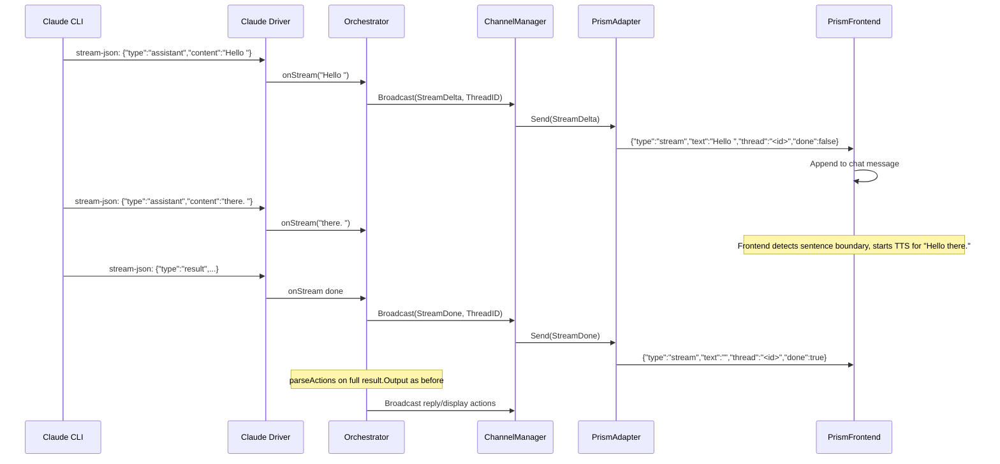

# Prism LLM Token Streaming (Phase C)

## Problem

When a user sends a message through Prism, `HandleUserMessage` calls `ConsultWithRepair`, which blocks until the Claude CLI finishes its entire response. The user sees 5-30+ seconds of silence. Meanwhile, the Claude CLI is already emitting `assistant` stream-json events with partial text content -- Anthem just ignores them.

## Goal

Stream partial LLM output from the Claude driver through the orchestrator and Prism channel adapter to the Prism frontend in real-time. This enables:
- Incremental text display in Prism's chat (like ChatGPT streaming)
- Sentence-by-sentence TTS synthesis while the LLM is still generating
- Visual artifacts can be displayed as soon as the LLM emits a `display` action

## Architecture



## Design Decisions

1. **Stream text only, not structured actions.** The orchestrator's JSON contract (reasoning + actions array) requires a complete response to parse. We stream the raw `assistant` content events as-is for UX, and still wait for the final `result` to extract and execute actions.

2. **New `stream` frame type on the Prism wire protocol.** Not `res` (which is the final reply) and not `event` (which is for system notifications). A new `type: "stream"` frame with `text` (delta), `thread` (correlation), and `done` (boolean).

3. **Callback-based streaming from the driver.** Add an `OnStream func(delta string)` callback to `ContinueOpts` (and `RunOpts`). The driver calls it from `parseStdout` for every `assistant` event's content. This avoids changing the `AgentRunner` interface -- the callback is optional (nil = no streaming).

4. **Prism-only streaming.** Dispatch and Slack adapters can ignore `stream` messages (they don't need incremental display). The Prism adapter sends `stream` frames; other adapters can skip or no-op.

5. **`OutgoingMessage` gets new fields.** Add `StreamDelta string` and `StreamDone bool` to `OutgoingMessage`. When `StreamDelta != ""`, the Prism adapter emits a `stream` frame instead of `res`/`event`.

## Changes Required

### 1. `internal/types/task.go` -- Add OnStream callback to RunOpts and ContinueOpts

Current `RunOpts` (line 112) has no streaming callback. Current `ContinueOpts` (line 124) has no streaming callback.

Add `OnStream func(delta string)` to both structs. Optional (nil means no streaming). Example:

```go
type RunOpts struct {
    // ... existing fields ...
    OnStream       func(delta string) // optional: called with partial text deltas
}

type ContinueOpts struct {
    // ... existing fields ...
    OnStream       func(delta string) // optional: called with partial text deltas
}
```

### 2. `internal/agent/claude/driver.go` -- Emit stream events from parseStdout

Currently `parseStdout` (line 177) only handles `event.Type == "result"` (line 198). All other event types including `assistant` are silently ignored.

The Claude CLI emits `assistant` type events with a `Content` field (string) in `StreamEvent` (defined in `parser.go` line 13). Add handling for `assistant` events:

```go
// Inside parseStdout's for loop, BEFORE the existing result check:
if event.Type == "assistant" && event.Content != "" && opts.OnStream != nil {
    opts.OnStream(event.Content)
}
```

The `parseStdout` function currently takes `(ctx, r, start, stallTimeout, onActivity, onResult)` but does NOT have access to the opts. You need to **pass opts (or just the OnStream callback) into parseStdout**.

Option A (recommended): Add `onStream func(string)` as a parameter to `parseStdout`.
Option B: Pass the full opts struct.

Then in `execute()` (line 91), pass `opts.OnStream` when calling `parseStdout` (line 148).

Since `Continue()` (line 63) calls `execute` with `types.RunOpts{StallTimeoutMS: opts.StallTimeoutMS}`, you need to also copy `OnStream` there:
```go
return d.execute(ctx, opts.WorkspacePath, args, types.RunOpts{
    StallTimeoutMS: opts.StallTimeoutMS,
    OnStream:       opts.OnStream,
})
```

### 3. `internal/channel/channel.go` -- Extend OutgoingMessage

Current `OutgoingMessage` (line 24) has `Text`, `ThreadID`, `Markdown`, `EventType`, `Ack`, `Display`.

Add two new fields:
```go
type OutgoingMessage struct {
    Text        string
    ThreadID    string
    Markdown    bool
    EventType   string
    Ack         bool
    Display     any    `json:"display,omitempty"`
    StreamDelta string `json:"stream_delta,omitempty"`
    StreamDone  bool   `json:"stream_done,omitempty"`
}
```

### 4. `internal/channel/prism/adapter.go` -- Send stream frames

The `frame` struct (line 26) needs a new `Done` field:
```go
type frame struct {
    // ... existing fields ...
    Done      bool   `json:"done,omitempty"`
}
```

In `Send()` (line 229), add a check **before** the existing display/text logic:
```go
func (a *Adapter) Send(_ context.Context, msg channel.OutgoingMessage) error {
    if msg.StreamDelta != "" || msg.StreamDone {
        return a.sendStream(msg)
    }
    // ... existing display/text logic unchanged ...
}
```

New `sendStream` method:
```go
func (a *Adapter) sendStream(msg channel.OutgoingMessage) error {
    f := frame{Type: "stream", Text: msg.StreamDelta, Thread: msg.ThreadID, Done: msg.StreamDone}

    if msg.ThreadID != "" {
        a.mu.RLock()
        entry, ok := a.threads[msg.ThreadID]
        a.mu.RUnlock()
        if ok {
            return entry.writeJSON(f)
        }
    }

    // Broadcast to all connected clients
    a.mu.RLock()
    entries := make([]*connEntry, 0, len(a.conns))
    for e := range a.conns {
        entries = append(entries, e)
    }
    a.mu.RUnlock()

    var firstErr error
    for _, e := range entries {
        if err := e.writeJSON(f); err != nil && firstErr == nil {
            firstErr = fmt.Errorf("prism stream broadcast: %w", err)
        }
    }
    return firstErr
}
```

### 5. `internal/channel/dispatch/adapter.go` -- Ignore stream messages

In the Dispatch adapter's `Send()` method, add an early return at the top:
```go
func (a *Adapter) Send(_ context.Context, msg channel.OutgoingMessage) error {
    if msg.StreamDelta != "" || msg.StreamDone {
        return nil // Dispatch doesn't support streaming
    }
    // ... existing logic unchanged ...
}
```

Also do the same for `internal/channel/slack/adapter.go` if its `Send()` could be called with stream messages.

### 6. `internal/orchestrator/orchagent.go` -- Add streaming variants

Add new methods that accept an `onStream` callback and pass it through to the runner:

```go
func (o *OrchestratorAgent) ConsultStreaming(ctx context.Context, state StateSnapshot, onStream func(string)) ([]Action, error) {
    if o.sessionID == "" {
        return o.StartStreaming(ctx, state, onStream)
    }

    if o.totalTokens > o.maxContextTokens {
        if err := o.Refresh(ctx, state); err != nil {
            return nil, err
        }
        return o.StartStreaming(ctx, state, onStream)
    }

    snapshot := state.Serialize()

    result, err := o.runner.Continue(ctx, o.sessionID, "## Updated State\n\n"+snapshot, types.ContinueOpts{
        PermissionMode: "bypassPermissions",
        OnStream:       onStream,
    })
    if err != nil {
        return nil, fmt.Errorf("orchestrator consult: %w", err)
    }

    o.sessionID = result.SessionID
    o.totalTokens += result.TokensIn + result.TokensOut

    actions, err := parseActions(result.Output)
    if err != nil {
        return nil, fmt.Errorf("orchestrator consult: parsing actions: %w", err)
    }

    return actions, nil
}

func (o *OrchestratorAgent) StartStreaming(ctx context.Context, state StateSnapshot, onStream func(string)) ([]Action, error) {
    prompt := buildSystemPrompt(o.voiceContent) + "\n\n## Current State\n\n" + state.Serialize()

    result, err := o.runner.Run(ctx, types.RunOpts{
        Prompt:         prompt,
        PermissionMode: "bypassPermissions",
        OnStream:       onStream,
    })
    if err != nil {
        return nil, fmt.Errorf("orchestrator start: %w", err)
    }

    o.sessionID = result.SessionID
    o.totalTokens += result.TokensIn + result.TokensOut

    actions, err := parseActions(result.Output)
    if err != nil {
        return nil, fmt.Errorf("orchestrator start: parsing actions: %w", err)
    }

    return actions, nil
}

func (o *OrchestratorAgent) ConsultWithRepairStreaming(ctx context.Context, state StateSnapshot, onStream func(string)) ([]Action, error) {
    actions, err := o.ConsultStreaming(ctx, state, onStream)
    if err == nil {
        return actions, nil
    }

    o.logger.Warn("orchestrator response parse failed, attempting repair", "error", err)

    if o.sessionID == "" {
        o.logger.Warn("no session to repair, falling back to mechanical dispatch")
        return nil, nil
    }

    result, repairErr := o.runner.Continue(ctx, o.sessionID, repairPrompt, types.ContinueOpts{
        PermissionMode: "bypassPermissions",
    })
    if repairErr != nil {
        o.logger.Warn("repair continue failed, falling back to mechanical dispatch", "error", repairErr)
        return nil, nil
    }

    o.totalTokens += result.TokensIn + result.TokensOut

    actions, err = parseActions(result.Output)
    if err != nil {
        o.logger.Warn("repair parse also failed, falling back to mechanical dispatch", "error", err)
        return nil, nil
    }

    return actions, nil
}
```

Note: Do NOT modify the existing `Consult`, `Start`, and `ConsultWithRepair` methods -- they are still used by `tick()` which does not need streaming.

### 7. `internal/orchestrator/orchestrator.go` -- Stream during HandleUserMessage

In `HandleUserMessage` (line 1088), replace line 1121:
```go
actions, err := o.orchAgent.ConsultWithRepair(ctx, snap)
```
with:
```go
onStream := func(delta string) {
    if o.channelMgr != nil {
        _ = o.channelMgr.Broadcast(ctx, channel.OutgoingMessage{
            StreamDelta: delta,
            ThreadID:    msg.ThreadID,
        })
    }
}
actions, err := o.orchAgent.ConsultWithRepairStreaming(ctx, snap, onStream)

// Signal stream completion so Prism can finalize the message
if o.channelMgr != nil {
    _ = o.channelMgr.Broadcast(ctx, channel.OutgoingMessage{
        StreamDone: true,
        ThreadID:   msg.ThreadID,
    })
}
```

The existing `sendFollowUp` calls for `ActionReply` remain unchanged -- they send the final complete text as a `res` frame for chat history. The `stream` frames provide the real-time UX; the `res` frame provides the canonical final message.

### 8. `internal/agent/mock.go` -- Update MockRunner

The `MockRunner` needs to support `OnStream` in its function signatures. Since `RunOpts` and `ContinueOpts` carry the callback as a field, no interface change is needed. But if tests want to verify streaming behavior, `RunFunc` can call `opts.OnStream("delta")` to simulate streaming.

### 9. Tests

**`internal/agent/claude/driver_test.go`**: Add a test that simulates Claude CLI output with `assistant` events before a `result` event. Verify that the `OnStream` callback on `RunOpts` is called with the correct content for each `assistant` event.

**`internal/channel/prism/adapter_test.go`**: Add a test that calls `Send()` with `StreamDelta` set and verifies the WebSocket frame has `type: "stream"`, correct `text`, `thread`, and `done` fields.

**`internal/orchestrator/orchagent_test.go`**: Add a test for `ConsultWithRepairStreaming` that verifies the `onStream` callback is passed through and called.

**`internal/orchestrator/usermsg_test.go`** (or add to `orchestrator_test.go`): Add a test for `HandleUserMessage` that verifies stream deltas are broadcast to the channel manager during consult, and a stream-done is sent after.

## What NOT to change

- `tick()` loop: no streaming needed for autonomous tick consults (no user waiting)
- `parseActions`: still operates on the full `result.Output` string after CLI finishes
- Slack/Dispatch adapters: skip stream messages (early return)
- Existing `res`/`event`/`display` frame types: unchanged
- `suggest_guest` frame: standalone frame type outside the stream lifecycle, used for post-round guest suggestions (broadcast by `suggestFollowUp` when `EnableGuestSuggestions` is enabled)
- `AgentRunner` interface: unchanged (callbacks are on opts structs, not the interface)

## Prism Frontend Side (already done, for reference)

Prism's frontend already needs to handle the new `stream` frame type:
- `useWebSocket.ts`: handle `msg.type === "stream"` -- append `msg.text` to an in-progress chat message, or finalize on `msg.done === true`
- `chatStore.ts`: add `updateMessage(tabId, messageId, appendText)` for streaming updates

These frontend changes are NOT part of this Anthem implementation -- they will be done in the Prism repo separately.
